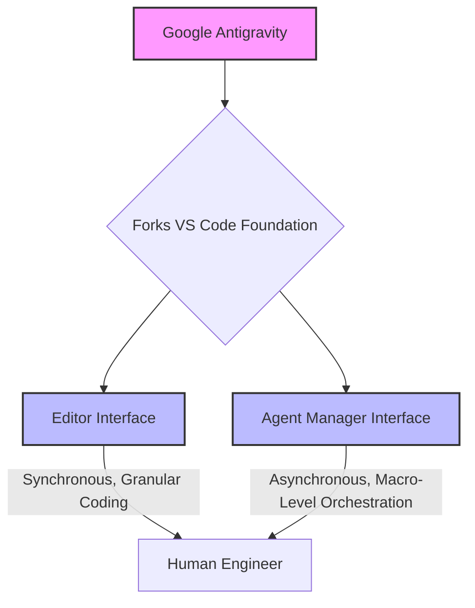
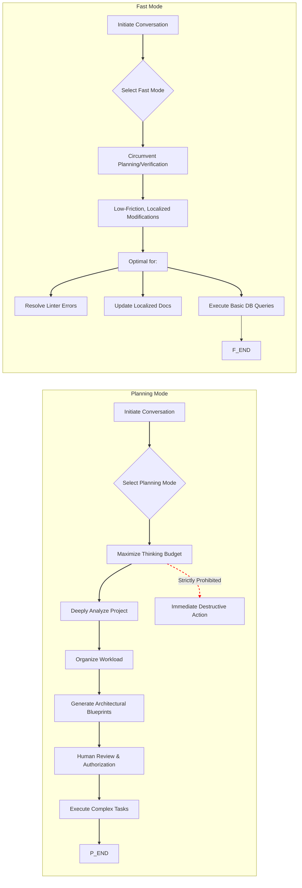

## 📑 Table of Contents

1. [The Paradigm of Autonomous Orchestration](#1-the-paradigm-of-autonomous-orchestration)
2. [Architectural Origins and Structural Bifurcation](#2-architectural-origins-and-structural-bifurcation)
3. [System Requirements and Local Operation](#3-system-requirements-and-local-operation)
4. [Anatomy of the Agent Manager Interface](#4-anatomy-of-the-agent-manager-interface)
   - 4.1. [The Workspace Directory and Playground](#41-the-workspace-directory-and-playground)
   - 4.2. [The Inbox and Asynchronous Communication](#42-the-inbox-and-asynchronous-communication)
   - 4.3. [Parallel Execution and The Risk of Context Contamination](#43-parallel-execution-and-the-risk-of-context-contamination)
5. [Foundation Models and Cognitive Routing](#5-foundation-models-and-cognitive-routing)
   - 5.1. [The Gemini 3.1 Pro Intelligence Engine](#51-the-gemini-31-pro-intelligence-engine)
   - 5.2. [Specialized Models within the Ecosystem](#52-specialized-models-within-the-ecosystem)
   - 5.3. [Cognitive Modes: Planning versus Fast Execution](#53-cognitive-modes-planning-versus-fast-execution)
6. [Bridging the Trust Gap: The Artifact Verification System](#6-bridging-the-trust-gap-the-artifact-verification-system)
   - 6.1. [Typology of Verification Artifacts](#61-typology-of-verification-artifacts)
7. [Asynchronous, Intuitive Feedback Loops](#7-asynchronous-intuitive-feedback-loops)
8. [Operational Methodologies and Sandboxing](#8-operational-methodologies-and-sandboxing)
   - 8.1. [Execution Policies and Security Configurations](#81-execution-policies-and-security-configurations)
9. [Operational Workflow 1: Dynamic Full-Stack Prototyping](#9-operational-workflow-1-dynamic-full-stack-prototyping)
10. [Operational Workflow 2: Enterprise Cloud Infrastructure Deployment](#10-operational-workflow-2-enterprise-cloud-infrastructure-deployment)
11. [Overcoming Context Saturation via the Model Context Protocol (MCP)](#11-overcoming-context-saturation-via-the-model-context-protocol-mcp)
    - 11.1. [Core Functionality Vectors of MCP Integration](#111-core-functionality-vectors-of-mcp-integration)
    - 11.2. [Implementation and Extension Methodologies](#112-implementation-and-extension-methodologies)
12. [Systemic Limitations, Hardware Degradation, and Economic Friction](#12-systemic-limitations-hardware-degradation-and-economic-friction)
    - 12.1. [Thermal Throttling and Interface Instability](#121-thermal-throttling-and-interface-instability)
13. [The Economics of Autonomy: Quotas and Rate Limits](#13-the-economics-of-autonomy-quotas-and-rate-limits)
    - 13.1. [Subscription Tier Discrepancies and User Sentiment](#131-subscription-tier-discrepancies-and-user-sentiment)
14. [Strategic Positioning and Market Viability](#14-strategic-positioning-and-market-viability)

---

## 1. The Paradigm of Autonomous Orchestration

The architecture of the Integrated Development Environment (IDE) is currently undergoing a foundational metamorphosis. For decades, the IDE functioned strictly as a passive canvas for human-generated logic, gradually evolving to incorporate reactive, computer-assisted text prediction and syntax highlighting. The recent proliferation of large language models initially introduced localized, synchronous coding assistants—tools capable of autocompleting lines or generating boilerplate within a localized file. However, this paradigm is rapidly being superseded by an **“agent-first”** architecture, a transition forcefully catalyzed by the public preview launch of Google Antigravity in November 2025.

Google Antigravity represents a fundamental departure from synchronous text editing, presupposing that artificial intelligence should no longer be constrained to the role of a reactive assistant, but elevated to an autonomous actor capable of multi-step planning, execution, and self-validation across complex engineering workflows. At the precise center of this operational evolution is the **Agent Manager**, a dedicated orchestration surface that fundamentally redefines how human engineers interact with codebases.

This exhaustive technical report provides a comprehensive analysis of the Agent Manager within Google Antigravity. It details the platform’s architectural origins, the sophisticated cognitive engines powering its autonomy, the precise operational methodologies required for local and cloud-based deployments, the integration of external data via the Model Context Protocol (MCP), and the acute systemic and economic limitations currently impacting enterprise adoption.

---

## 2. Architectural Origins and Structural Bifurcation

The developmental trajectory of Google Antigravity is inextricably linked to Google’s strategic acquisition of the Windsurf team in July 2025 for $2.4 billion. The integration of Windsurf’s engineering talent and executive leadership directly influenced Antigravity’s shift from a traditional AI-assisted editor toward a comprehensive mission control center for autonomous agents. This strategic infusion of capital and specialized talent resulted in a platform that social media commentators and industry analysts have characterized as operating in **“Founder mode,”** reflecting a highly aggressive, ambitious product vision deeply tied to Google co-founder Sergey Brin’s re-engagement with the company’s AI initiatives.

To manifest this agent-first vision, Antigravity forks the ubiquitous, open-source Visual Studio Code (VS Code) foundation. However, it radically alters the conventional user experience by bifurcating the interface into two distinct, primary operational windows: the **Editor** and the **Agent Manager**.

_Figure 1: Google Antigravity Interface Bifurcation_

This bifurcation is not merely a user interface aesthetic; it is a profound philosophical statement regarding cognitive load and workflow optimization. The **Editor** retains the familiar, synchronous, hands-on coding experience favored for granular text manipulation, complete with tab completions and localized inline commands. Conversely, the **Agent Manager** is engineered to operate at a higher level of abstraction, providing a macro-level, bird’s-eye view of ongoing automated tasks.

The engineering teams explicitly decided against compressing the asynchronous capabilities of the **Agent Manager** and the synchronous workflows of the **Editor** into a single, cluttered window pane. Instead, the platform is optimized for instantaneous, low-friction handoffs between the two environments. Developers can toggle their cognitive focus dynamically using keyboard shortcuts (CMD+E on macOS, CTRL+E on Windows) or through dedicated “Open Editor” and “Open Agent Manager” interface buttons located within the top right menu bar.

---

## 3. System Requirements and Local Operation

- **macOS (Apple Silicon)**: Full support for macOS 12 (Monterey) and subsequent releases. The platform officially supports the current operating system alongside the two preceding versions receiving active Apple security updates. Notably, legacy x86 architectures are strictly unsupported.
- **Windows Desktop**: Requires Windows 10 (64-bit) architecture to facilitate the necessary memory allocation for local agent orchestration and browser subagent rendering.
- **Linux Distributions**: The local runtime necessitates specific standard C library dependencies, specifically requiring glibc >= 2.28 and glibcxx >= 3.4.25. This ensures compatibility with modern distributions such as Ubuntu 20, Debian 10, Fedora 36, or RHEL 8.
- Accessing the public preview necessitates a personal Gmail account for authentication, which subsequently ties the local installation to Google’s centralized quota and model access management systems.

---

## 4. Anatomy of the Agent Manager Interface

The **Agent Manager** is designed as a high-level orchestration dashboard, enabling human developers to transition from writing imperative code to defining declarative outcomes. By operating within this surface, users can oversee dozens of independent agents simultaneously, delegating complex maintenance tasks, bug fixes, or feature implementations into asynchronous background processes while reserving their primary cognitive focus for synchronous foreground development.

The interface is constructed around several core modules, each engineered to facilitate the management of parallel autonomous workloads without inducing context switching fatigue.

### 4.1. The Workspace Directory and Playground

The foundation of the **Agent Manager** is its **Workspace** directory. A workspace represents a bounded context—typically a specific local directory, repository, or project environment. Within the Agent Manager, users can load multiple independent workspaces, effectively managing disparate projects from a centralized command module.

To facilitate rapid prototyping and architectural ideation without polluting established repositories, the **Agent Manager** introduces the **Playground**. The Playground functions as a sandboxed, ephemeral workspace. Developers can initiate conversations, test theoretical code structures, and evaluate agent responses within this isolated environment. If an experimental prototype within the Playground proves viable, the platform allows the developer to formalize it, seamlessly migrating the generated code and agent context into a permanent local workspace directory.

### 4.2. The Inbox and Asynchronous Communication

When a human developer delegates a task to an autonomous agent, they inherently require a mechanism to track progress, authorize destructive actions, and provide corrective feedback. In Google Antigravity, this mechanism is centralized within the **Inbox**.

The **Inbox** serves as the asynchronous communication ledger for all active agents across all active workspaces. As models like Gemini 3 achieve higher degrees of autonomous intelligence, they are capable of running for extended periods across multiple surfaces (terminal, editor, browser) without requiring continuous human intervention. However, when an agent reaches a critical decision node—such as requiring authorization to execute a potentially destructive terminal command or needing human validation on a proposed architectural blueprint—it generates a notification within the **Inbox**.

This centralization ensures that developers remain updated on the latest approvals or feedback requests without needing to manually poll individual agent chat windows. The **Inbox** aggregates these state changes, allowing the human orchestrator to approve a pull request generated by one agent, authorize a shell script executed by another, and provide design feedback to a third, all from a single consolidated interface.

### 4.3. Parallel Execution and The Risk of Context Contamination

The most sophisticated operational capacity of the **Agent Manager** is its ability to spin up and manage multiple agents in parallel. A developer can leverage the Agent Manager to orchestrate a highly efficient, multi-threaded workflow.

For instance, a user can deploy one agent within a documentation repository to generate protocol explanations, while simultaneously instructing a second agent in a distinct codebase to author unit tests, and directing a third agent to execute routine blog maintenance tasks.

However, this parallel processing capability introduces unique systemic risks, primarily the phenomenon of “cross-contamination of prompts”. The official platform documentation and empirical community feedback strongly advise maintaining a strict ratio of one agent per workspace.

While the software technically permits spawning multiple agents within the same localized project folder, doing so frequently results in cognitive overlap. In these scenarios, an agent may suffer from contextual hallucinations, erroneously pulling variable definitions, architectural patterns, or specific task instructions from a parallel agent operating within the same directory space. Therefore, isolating agents via strict workspace boundaries is a critical operational mandate for maintaining code integrity and preventing cascading logic failures across the development lifecycle.

---

## 5. Foundation Models and Cognitive Routing

The degree of autonomy exhibited by the Agent Manager is entirely contingent upon the cognitive capabilities of its underlying Large Language Models (LLMs). Google Antigravity operates as a model-agnostic platform, providing developers with extensive optionality to select the appropriate intelligence engine for specific tasks.

The platform supports a diverse ecosystem of reasoning engines, offering generous native rate limits on Google’s proprietary Gemini tier while providing full operational support for third-party frontier models, including Anthropic’s Claude 4.5 Sonnet, Claude 4.6 Opus, and the GPT-OSS-120b architecture.

### 5.1. The Gemini 3.1 Pro Intelligence Engine

The centerpiece of the Antigravity intelligence ecosystem is the newly deployed Gemini 3.1 Pro model. Representing a significant advancement over the base Gemini 3 architecture, the 3.1 iteration integrates the advanced reasoning engine originally pioneered in the Gemini 3 Deep Think project.

The implementation of Gemini 3.1 Pro signals a calculated shift away from broad feature expansion toward a highly focused upgrade in core reasoning and multi-step logic processing. This capability is objectively quantified by the model’s performance on the ARC-AGI-2 benchmark, a rigorous evaluation framework designed to test an artificial intelligence’s capacity to deduce and solve entirely novel logic patterns without prior specific training. On this benchmark, Gemini 3.1 Pro achieved a verified score of 77.1%, effectively doubling the reasoning performance of the preceding Gemini 3 Pro model.

Within the context of the Agent Manager, this advanced reasoning is not merely a theoretical metric; it is the functional prerequisite for autonomous orchestration. When an agent is tasked with a highly complex, open-ended directive—such as “refactor this monolithic authentication service into microservices while maintaining existing database schemas”—it relies entirely on the Deep Think cognitive architecture to parse the request, map the dependencies, and sequence the execution safely without human intervention.

### 5.2. Specialized Models within the Ecosystem

Beyond general reasoning, the Agent Manager can route tasks to specialized models optimized for specific developmental outputs. The current public preview features the following optimized engines:

| Foundation Model | Primary Operational Utility within the Agent Manager |
| --- | --- |
| **Gemini 3.1 Pro** | The default, high-intelligence engine utilized for complex architectural planning, extensive codebase refactoring, and multi-step terminal/browser orchestration. |
| **Gemini 3 Flash** | A highly optimized, low-latency model designed for rapid, synchronous operations. Utilized primarily when the agent is required to execute simple, localized tasks such as variable renaming, minor syntax correction, or basic shell commands. |
| **Nano Banana Pro** | A highly specialized generative model integrated within the ecosystem, specifically engineered to create, edit, and manipulate visual assets with studio-quality precision. This model is invoked when developers instruct the agent to generate UI assets, such as specific background images or icons, directly within the IDE. |
| **Claude Sonnet 4.5 & Opus 4.6** | Anthropic’s frontier models, fully supported within the platform to provide developers with alternative cognitive architectures, often favored for specific linguistic or formatting nuances in documentation and code generation. |

### 5.3. Cognitive Modes: Planning versus Fast Execution

To optimize token consumption, reduce latency, and align the model’s computational budget with the complexity of the user’s prompt, the Agent Manager utilizes distinct execution modes.

When a developer initiates a conversation, they must select an operational mode alongside their model of choice. The Planning Mode allocates the maximum available “thinking budget” to the agent. In this state, the agent is strictly prohibited from taking immediate, destructive action. Instead, it utilizes its advanced reasoning capabilities to deeply analyze the project structure, organize the workload into sequential task groups, and generate comprehensive architectural blueprints for human review. This mode is mandatory for deep engineering tasks.

Conversely, the Fast Mode circumvents the extensive planning and verification phases. It is designed for low-friction, localized modifications where the overhead of generating detailed implementation plans would unnecessarily impede developer velocity. Fast mode is optimal for resolving linter errors, updating localized documentation strings, or executing basic database queries.

_Figure 2: Cognitive Modes: Planning vs. Fast Execution_

---

## 6. Bridging the Trust Gap: The Artifact Verification System

The fundamental obstacle to mainstream enterprise adoption of autonomous agentic platforms is the “Trust Gap”. In a traditional IDE, the developer types every line of code, possessing an intimate, synchronous understanding of the application’s state. When a developer offloads complex workflows to an autonomous agent operating within the asynchronous Agent Manager, this localized understanding is severed.

If an agent autonomously modifies dozens of files, installs multiple dependencies via package managers, and alters database schemas, the human developer is left blind. Attempting to verify the safety and efficacy of these actions by scrolling through raw, chronological logs of tool calls and terminal outputs is an intractable, tedious burden that effectively negates the productivity gains of the initial automation.

To definitively resolve this paradigm, Google Antigravity introduces an exhaustive, Artifact-driven verification system. The platform forces agents to synthesize their logic, actions, and results into high-level, tangible deliverables known as Artifacts. These Artifacts serve as cryptographic proofs of the agent’s reasoning, allowing the human orchestrator to quickly verify logical correctness at a glance before, during, and after execution.

### 6.1. Typology of Verification Artifacts

The Artifact generation system is dynamic, producing different classes of documents based on the operational mode and the specific requirements of the prompt. The primary Artifact typologies include:

| Artifact Classification | Generation Phase | Verification Utility and Functionality |
| --- | --- | --- |
| **Task Lists** | Pre-execution | A high-level, hierarchical enumeration of the sequential steps the agent intends to take to fulfill the user’s directive. This allows the developer to audit the agent’s deductive reasoning and ensure it has correctly interpreted the scope of the prompt before any computational resources are expended. |
| **Implementation Plans** | Pre-execution | A granular, deeply technical blueprint detailing the precise architectural modifications required. This artifact specifies which files will be altered, the exact libraries that will be imported, and the structural patterns that will be employed. It serves as a preventative measure against architectural drift, ensuring the agent adheres to enterprise standards. |
| **Code Diffs** | Mid-execution | A standard comparative view, accessible via the “Review Changes” interface within the Editor, displaying the precise lines of code inserted, modified, or deleted. |
| **Walkthroughs** | Post-execution | A comprehensive summary document generated after the agent completes a task. It details the exact changes implemented, the terminal commands successfully executed, and the empirical results of any automated testing protocols. This artifact acts as a permanent audit trail for peer review and compliance tracking. |
| **Visual Evidence** | Post-execution | Tangible, visual proofs generated by the integrated browser subagent. These include high-resolution screenshots and MP4 browser recordings demonstrating UI rendering or functional application deployment. This allows frontend and full-stack developers to verify aesthetic and functional requirements without needing to manually spin up local development servers and navigate the browser. |

---

## 7. Asynchronous, Intuitive Feedback Loops

The generation of Artifacts is only the first half of the verification equation; the system must also facilitate seamless course correction. Traditional AI coding assistants treat feedback as a rigid, black-or-white process—if the model generates an incorrect output, the user must halt the entire process, rewrite the prompt, and force the model to regenerate the response from scratch.

The Agent Manager eliminates this friction by introducing an intuitive, asynchronous feedback mechanism modeled after collaborative word processing software. Developers interact with the generated Artifacts and code diffs using “Google Docs-style comments”.

If an implementation plan outlines a suboptimal database indexing strategy, the developer does not need to abort the agent’s execution. They simply highlight the offending text within the Artifact and leave a localized comment providing explicit instructions on the preferred architecture. Similarly, if the agent generates a screenshot of a newly implemented user interface featuring misaligned CSS flexbox elements, the developer can utilize a select-and-comment bounding box directly on the visual artifact to denote the precise rendering error.

The underlying cognitive engine continuously monitors these artifact metadata layers. Upon detecting user feedback, the agent seamlessly ingests the corrective context and automatically incorporates the alterations into its ongoing execution flow, adjusting its trajectory without requiring a complete systemic restart or synchronous interruption.

---

## 8. Operational Methodologies and Sandboxing

Deploying an autonomous intelligence with unrestricted read/write access to a local host machine presents profound security vulnerabilities. To mitigate these risks, the Agent Manager relies on a robust framework of execution policies and systemic sandboxing. Before a developer can safely orchestrate complex workflows, they must establish explicit boundary conditions determining the precise level of autonomy granted to the agents.

### 8.1. Execution Policies and Security Configurations

These parameters are configured via the Antigravity — Settings > Advanced Settings menu, dictating the friction required before the agent can interact with the underlying operating system.

- **Terminal Command Auto Execution Policy:** This is the most critical security vector. The policy dictates how the agent interfaces with the shell environment. Setting this parameter to “Always Proceed” grants the agent unfettered authorization to execute bash scripts, install packages, and modify system directories autonomously. For enterprise environments or unverified codebases, security best practices dictate setting this to “Request Review,” which forces a synchronous human approval prompt prior to the execution of any terminal command.
- **Artifact Review Policy:** This setting controls the workflow cadence by determining when the agent must halt and request feedback on strategic documents, such as Task Lists and Implementation Plans. Developers can select “Always Proceed” for rapid autonomous iteration, “Request Review” for strict oversight, or “Agent Decides,” a sophisticated setting that allows the underlying LLM to evaluate its own confidence intervals and only pause for human validation when its internal certainty metrics fall below a defined threshold.
- **JavaScript Execution Policy:** This parameter governs the integrated browser subagent’s capabilities. When set to “Always Proceed,” the agent can execute dynamic JavaScript within the browser environment to interact with complex DOM elements, authenticate forms, and scrape highly dynamic single-page applications for context.

To provide granular control over the terminal environment, developers can leverage explicitly defined Allow Lists and Deny Lists. If a developer prefers a zero-trust architecture, they can disable the overarching Terminal Auto Execution policy and manually populate the Allow List with specific, benign commands (e.g., ls -al, git status, npm run test). Conversely, when operating in highly autonomous modes, developers must populate the Deny List to explicitly forbid sensitive, destructive operations (e.g., recursive deletions or unauthorized remote curl executions).

---

## 9. Operational Workflow 1: Dynamic Full-Stack Prototyping

The true power of the Agent Manager is realized when observing its capacity to ingest a high-level, declarative prompt and autonomously orchestrate the entire software development lifecycle.

A canonical use case involves the rapid generation of a dynamic, full-stack Python web application. Utilizing the Playground workspace, a developer can bypass hours of boilerplate coding by providing a comprehensive, detailed prompt outlining the desired end-state.

The input vector must be meticulously detailed, specifying the exact technological stack (Python utilizing the Flask framework for server-side logic, integrated with HTML, CSS, and vanilla JavaScript for the client-side rendering).

The prompt must dictate the required data structures, such as instructing the agent to construct an application for a 1-day technical conference featuring a dynamic home page, current date and location displays, and a specific event schedule encompassing exactly 8 unique talks with a designated 60-minute lunch break.

The developer specifies that each talk must possess an ID, Title, Description, category categorization, and speaker profiles containing First Name, Last Name, and corresponding LinkedIn URLs.

Finally, the prompt mandates explicit functionality, such as a user-facing search protocol allowing filtration by category or speaker, and requests the generation of a detailed README file alongside the automated launch of the localized application for immediate review.

Upon receiving this directive, the Agent Manager initiates the asynchronous planning phase, populating the Inbox with the initial Task Artifact and the subsequent Implementation Artifact. Once the human developer authorizes the plan, the agent autonomously generates the folder structure, authors the Python routing logic, constructs the frontend templates, and injects simulated dummy data focusing on Google Cloud Technologies to populate the views.

Crucially, the agent handles the technical heavy lifting of the deployment process seamlessly.

When attempting to launch the Flask server, the agent actively monitors the terminal output. If it detects that the default execution port (typically port 5000) is currently occupied by a background process, the agent does not crash or throw an unhandled exception. Instead, it utilizes its terminal awareness to autonomously cycle through available local network interfaces until it successfully binds the application to a free port (e.g., port 8080).

Following successful deployment, the integrated browser subagent automatically navigates to the localized URL, verifies the rendering of the DOM elements, tests the search functionality, and captures a comprehensive video recording of the verification process. This Media Artifact, alongside a detailed Walkthrough Artifact documenting the entire sequence of events and the final execution URL, is deposited into the Agent Manager, completing the prototyping lifecycle with minimal synchronous human intervention.

Developers can subsequently switch focus back to the synchronous Editor interface to perform targeted, line-by-line refinements, or utilize the localized side panel to issue follow-up declarative instructions, such as requesting the addition of a “calm and aesthetic” UI timer or generating unit tests incorporating mock implementations for external payment gateways.

---

## 10. Operational Workflow 2: Enterprise Cloud Infrastructure Deployment

The operational capacity of the Agent Manager scales beyond localized prototyping to encompass complex, multi-resource cloud infrastructure orchestration. Antigravity can be utilized to architect and deploy serverless, event-driven applications directly to production environments, such as the Google Cloud Platform (GCP).

This workflow necessitates a strict adherence to the “Request Review” security policies to ensure no cloud resources are provisioned without explicit financial and architectural authorization.

The developer initiates the process in Planning mode, utilizing the Gemini 3.1 Pro model to define a comprehensive document processing pipeline architecture.

The prompt details an ingestion phase utilizing a Cloud Storage (GCS) bucket, an event-trigger mechanism utilizing Pub/Sub messaging, an asynchronous processing layer executing a Python/Flask application within a containerized Cloud Run environment, and a permanent storage solution streaming metadata (filename, date, tagging metrics, and word counts) into a BigQuery dataset.

The Agent Manager first generates the Implementation Plan, allowing the developer to audit critical infrastructure details, including the selected deployment regions, exact project IDs, and resource naming conventions (e.g., ensuring the bucket is named doc-ingestion-{project-id}).

Upon human validation, the agent autonomously generates the required application codebase (main.py), containerization instructions (Dockerfile, requirements.txt), and a master infrastructure-as-code deployment shell script (setup.sh).

As the agent executes the script via the terminal, it pauses to request user acceptance before executing the high-impact gcloud CLI commands required to enable the respective APIs (Cloud Run, Pub/Sub, BigQuery, Storage). Once authorized, the agent autonomously orchestrates the creation of the BigQuery table schema (pipeline_data.processed_docs), provisions the Pub/Sub topics, and initiates the remote container build process to deploy the Cloud Run service, automatically binding the necessary “Push” delivery type subscriptions to link the distributed architecture.

The verification phase of this workflow demonstrates the highest level of systemic autonomy. The agent does not merely report that the deployment scripts executed successfully; it actively validates the data pipeline’s functional integrity. It autonomously authors a test artifact (test.txt), utilizes the localized gsutil command-line utility to upload the file to the newly provisioned GCS bucket, and subsequently executes a remote SQL query against the BigQuery instance to mathematically verify that the extracted metadata rows were successfully persisted in the database. This empirical proof is compiled into the final Walkthrough artifact, allowing the developer to confidently verify the deployment without manually authenticating into the GCP console interface.

---

## 11. Overcoming Context Saturation via the Model Context Protocol (MCP)

A critical historical limitation of early-generation AI coding assistants was the phenomenon known as “Context Saturation”. While frontier models like Gemini 3.1 Pro boast massive contextual windows capable of processing millions of tokens simultaneously, indiscriminately dumping an entire enterprise codebase, complete with redundant dependencies and legacy documentation, into the context window degrades reasoning performance, increases operational latency, and maximizes computational costs. Furthermore, isolated, localized agents inherently lack awareness of external, centralized corporate systems, such as remote relational databases, proprietary issue trackers, or continuous integration platforms.

To permanently resolve this architectural bottleneck, Google Antigravity seamlessly integrates the Model Context Protocol (MCP) into the core framework of the Agent Manager.

MCP functions as a standardized, secure data bridge, connecting the localized IDE environment directly to the developer’s broader external toolchain. Rather than forcing developers to manually copy and paste database schemas, API responses, or system logs into the conversational prompt to provide context, MCP enables Antigravity agents to dynamically, autonomously fetch precise, granular information directly from remote servers exactly when required by the execution logic.

Within the Antigravity ecosystem, these MCP integrations are colloquially referred to as “Skills”. Skills represent a lightweight, open-source formatting standard specifically designed to extend the AI agent’s baseline capabilities by providing specialized, real-time context and secure execution vectors.

### 11.1. Core Functionality Vectors of MCP Integration

The integration of MCP servers transforms the autonomous agent from a localized code generator into a contextually aware enterprise systems operator. This operational shift is facilitated across two primary vectors: Contextual Resources and Custom Tool Execution.

- **Dynamic Context Resources:** MCP allows the underlying reasoning model to read structured data from securely connected remote servers to ground its generative suggestions in empirical reality. For example, if a developer instructs an agent to author a complex, multi-join SQL query, the agent utilizes its MCP connection to inspect the live, remote database schema hosted on platforms such as Neon or Supabase. By dynamically querying the remote server, the agent injects the exact, current table structures and specific column names into its localized context window, fundamentally eliminating the risk of schema hallucinations and ensuring the generated query is syntactically perfect for the production environment. Similarly, during complex debugging workflows, the agent can autonomously pull recent, highly specific build logs directly from deployment platforms like Heroku or Netlify to accurately diagnose remote compilation failures.
- **Custom Tool Execution Vectors:** Beyond passive reading, MCP enables Antigravity agents to execute highly specific, predefined, and safe actions within connected external systems. A developer can instruct an agent to “Create a Linear issue for this TODO block in the codebase,” or request the agent to “Search the corporate Notion database or GitHub repository for the organization’s standardized authentication design patterns”.

### 11.2. Implementation and Extension Methodologies

The Antigravity platform provides a streamlined architecture for configuring and deploying these custom MCP servers. Developers can access a centralized MCP store via the agent panel interface, allowing them to manage connected servers or directly modify the underlying mcp_config.json configuration file to establish bespoke connections to proprietary internal infrastructure.

The ecosystem surrounding MCP is rapidly expanding, with significant integrations already documented across major enterprise platforms. The Atlassian Forge MCP server, for example, allows developers building Jira applications to interact directly with Jira APIs. When configured, developers can explicitly address the Forge server using targeted prefixes (e.g., @mcp:forge-knowledge: What Forge module do I need to listen to Jira comment events). However, the intelligence of the Agent Manager allows it to automatically route queries to the appropriate MCP server when it deduces that the context of the command relates to the Forge ecosystem.

Similarly, developers operating within the Google ecosystem can leverage the Firebase MCP server to enhance AI assistance across Firebase project configurations. This extension can be installed globally and integrated into Antigravity, as well as alternative environments like the Gemini CLI, Cursor, and Cline, by modifying the respective mcp_settings.json architectures.

Crucially, the Antigravity platform treats organizational learning and context retention as core primitives. When an agent derives novel insights, architectural patterns, or specific configuration parameters from its interactions with remote MCP servers, it does not discard that context upon task completion. Instead, the Agent Manager automatically maintains a localized, persistent file named AGENTS.md within the root directory of the workspace. The agent continuously updates this markdown file with synthesized content derived from its MCP queries, effectively creating an evolving, localized knowledge base that improves the speed and accuracy of future autonomous executions.

---

## 12. Systemic Limitations, Hardware Degradation, and Economic Friction

Despite the profound theoretical elegance and practical utility of the Agent Manager architecture, the public preview phase of Google Antigravity has illuminated several acute systemic limitations. These challenges primarily revolve around localized hardware degradation, platform stability issues, and highly controversial economic and quota-based constraints.

### 12.1. Thermal Throttling and Interface Instability

The core value proposition of the Agent Manager—the ability to orchestrate “dozens of agents simultaneously”—conflicts violently with the physical realities of modern developer hardware.

Orchestrating multiple parallel agents via the Manager surface generates an immense localized processing overhead. The continuous, concurrent parsing of file system changes, the real-time monitoring of multiple terminal input/output streams, and the heavy rendering requirements of the integrated browser subagent executing dynamic JavaScript place extraordinary strain on the host machine’s CPU and memory architecture.

Early enterprise adopters and technical reviewers have documented severe hardware degradation during multi-agent workflows. Users report that deploying the Agent Manager on premium hardware, such as Apple MacBook Pros, frequently leads to rapid thermal throttling, as the processors reach critical temperatures attempting to manage the asynchronous workload.

Furthermore, the Agent Manager interface itself is susceptible to severe performance instability. Empirical feedback indicates that the Manager UI can be exceptionally buggy under sustained load, occasionally grinding to a complete halt after just ten to fifteen minutes of complex asynchronous orchestration.

Consequently, a subset of power users has entirely abandoned the sophisticated Agent Manager surface. To maintain system stability while still utilizing the AI capabilities, these developers opt to manually open two or more distinct, synchronous Editor windows side-by-side. This methodology allows them to manually enforce workload separation across different projects (e.g., front-end vs. back-end) without incurring the immense, centralized processing overhead associated with the Manager’s parallel orchestration architecture.

---

## 13. The Economics of Autonomy: Quotas and Rate Limits

The most significant barrier impeding the widespread enterprise adoption of Google Antigravity is its aggressive and highly controversial computational rate-limiting infrastructure.

Google formally advertises the Antigravity platform as a **“No-cost public preview,”** accessible to any developer utilizing a personal Gmail account, featuring a highly attractive **“$0/month baseline tier”** encompassing unlimited tab completions and access to the premier Gemini 3.1 Pro model. However, access to these advanced cognitive capabilities is stringently metered through a rigid quota system.

The platform enforces a rolling quota that refreshes strictly every five hours. This quota is not measured by basic prompt interactions, but is intricately correlated to the computational **“work done”** by the agent. Highly complex, multi-step operations executed in **Planning Mode**—such as refactoring entire codebases, synthesizing comprehensive test suites, or generating intricate infrastructure-as-code blueprints—consume vastly more quota than straightforward, localized operations executed in **Fast Mode**.

When an agent exhausts its allocated quota during an asynchronous task, the execution process does not throttle; it terminates abruptly. The developer receives a rate limit notification and is subsequently locked out of advanced autonomous features, forced to wait out the remainder of the five-hour cooldown period before the agent can resume operation, a delay that severely disrupts enterprise momentum and sprint velocity.

### 13.1. Subscription Tier Discrepancies and User Sentiment

The application of these rate limits has generated significant friction within the developer community, primarily due to the platform’s complete disregard for existing premium subscription tiers.

Developers who financially support the Google ecosystem by paying premium monthly subscriptions for Google AI Ultra or Gemini Advanced are placed into the exact same localized resource bucket as users operating on the completely free tier. The expectation of priority access, higher computational caps, or accelerated quota refresh rates for paying subscribers is entirely unmet. This architectural decision has led to vocal dissatisfaction, with power users on community forums characterizing the rate limits as a **“slap in the face”** to early adopters who theoretically fund the ecosystem.

While users acknowledge that the platform is explicitly labeled as a **public preview**, the inability to leverage premium, paid-for compute power within Google’s flagship developer tool severely undermines the perceived value of the broader Gemini subscription ecosystem.

For organizations seeking to bypass these limitations, Google restricts enhanced access. True enterprise scalability—featuring dedicated computational quotas and uncapped agentic orchestration—is gated behind **“Google AI Ultra for Business,”** a specialized organizational tier that bypasses standard public pricing models entirely and requires direct engagement with Google’s enterprise sales division for customized contract negotiation.

---

## 14. Strategic Positioning and Market Viability

The future viability of the Agent Manager is not solely dependent on overcoming technical hurdles; it is equally reliant on Google’s overarching strategic positioning within the fiercely competitive AI developer tools market.

The market dynamics surrounding Antigravity are remarkably complex. Google directly participated as a major investor in the Series D funding round for **Cursor**, the primary incumbent competitor in the AI IDE space. By simultaneously developing Antigravity internally while heavily financing its direct external rival, Google is executing a calculated **hedging strategy**. This financial positioning suggests that Google views the domination of the AI IDE sector as a critical corporate imperative, but remains agnostic as to whether the ultimate market victor will be an internal product or a portfolio company.

This strategic hedging is acutely felt by the developer community, who closely monitor the organizational commitment signals radiating from Google’s senior leadership. Within the tech industry, long-term organizational commitment often functions as a self-fulfilling prophecy; if developers perceive that a platform lacks high-level executive support, they will refuse to invest the hundreds of hours required to integrate it into their daily workflows, inevitably leading to the product’s stagnation and deprecation.

Currently, the communication strategy surrounding Antigravity appears heavily siloed. While senior Google executives consistently champion and heavily promote updates, features, and launches related to **Google AI Studio**, public advocacy for Antigravity is notably muted, relegated primarily to occasional updates from members of the acquired **Windsurf engineering team**. In the ecosystem of developer tools, products that are viewed as core to a company’s future are championed loudly from the top down, whereas experimental hedges are often managed quietly from the middle tiers. Unless Google’s executive leadership clearly and consistently validates Antigravity as a core, long-term pillar of its AI strategy, the sophisticated architecture of the Agent Manager may struggle to secure the widespread developer trust necessary to achieve true market dominance.
