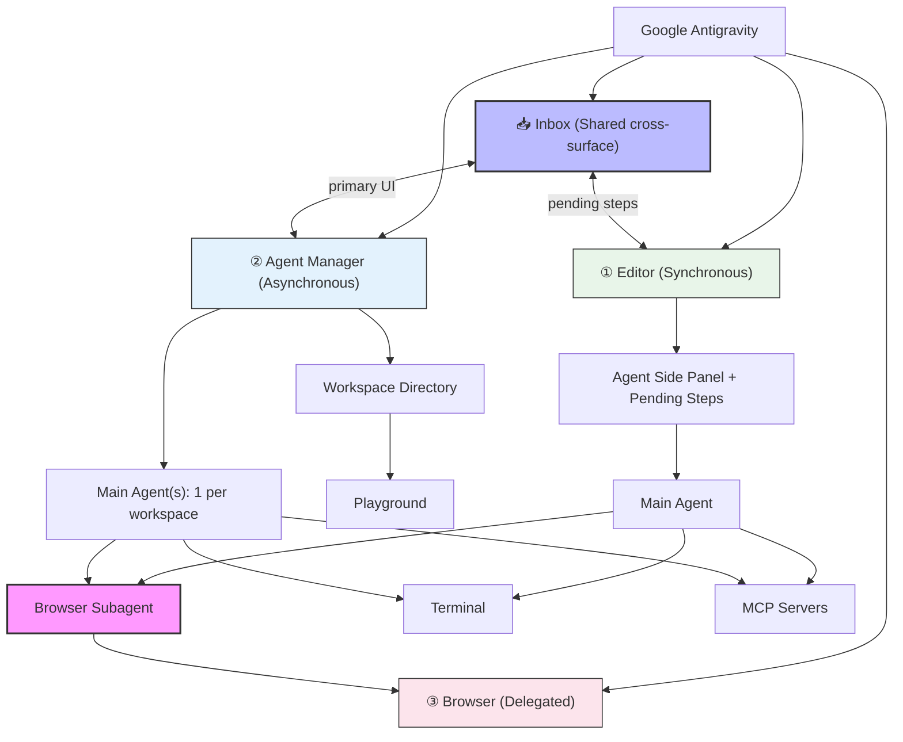
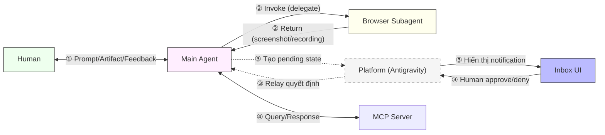
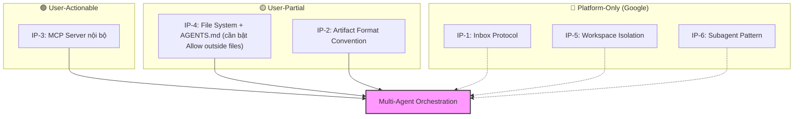

Bài phân tích này nghiên cứu kiến trúc cộng tác giữa các thành phần Agent, Browser Subagent, và Agent Manager trong nền tảng Google Antigravity. Dựa trên hai nguồn tài liệu chính — ebook tài liệu chính thống (Official) và ebook phân tích độc lập (Unofficial) — paper xác định cơ chế phân cấp delegation, giao thức giao tiếp qua Artifact, vai trò của từng thành phần, và đưa ra kết luận về các khía cạnh có thể điều chỉnh để xây dựng luồng quản lý đa agent hoạt động đồng thời.

---

## Mục lục

- [Abstract](#abstract)
- [1. Context & Motivation](#1-context-motivation)
- [2. Methodology](#2-methodology)
  - [2.1 Nguồn dữ liệu](#21-nguồn-dữ-liệu)
  - [2.2 Phương pháp](#22-phương-pháp)
- [3. Analysis](#3-analysis)
  - [3.1 Bản đồ Thành phần (Component Map)](#31-bản-đồ-thành-phần-component-map)
  - [3.2 Editor — Entry Point Chính](#32-editor-entry-point-chính-synchronous)
    - [3.2.1 Main Agent — Trung tâm Suy luận](#321-main-agent-trung-tâm-suy-luận)
    - [3.2.2 4 Lớp Tương tác](#322-4-lớp-tương-tác-từ-nhẹ-nặng)
    - [3.2.3 Strict Mode & Sandboxing](#323-strict-mode-sandboxing)
    - [3.2.4 Đặc điểm cho Multi-Agent](#324-đặc-điểm-cho-multi-agent)
  - [3.3 Agent Manager — Bề mặt Điều phối](#33-agent-manager-bề-mặt-điều-phối-asynchronous)
    - [3.3.1 Workspace & Isolation](#331-workspace-isolation)
    - [3.3.2 Main Agent(N) — 1 per Workspace](#332-main-agentn-1-per-workspace)
    - [3.3.3 Rủi ro Context Contamination](#333-rủi-ro-context-contamination)
    - [3.3.4 Phân lập Model Selection và Nghi vấn Context Leakage](#334-phân-lập-model-selection-và-nghi-vấn-context-leakage)
  - [3.4 Browser — Bề mặt Ủy quyền](#34-browser-bề-mặt-ủy-quyền-delegated)
    - [3.4.1 Browser Subagent — Agent Cấp 2](#341-browser-subagent-agent-cấp-2)
    - [3.4.2 Model Tách biệt](#342-model-tách-biệt)
    - [3.4.3 Toolset Chuyên biệt](#343-toolset-chuyên-biệt)
    - [3.4.4 Tính Bất đồng bộ với User](#344-tính-bất-đồng-bộ-với-user)
  - [3.5 Giao thức Giao tiếp & Thông báo](#35-giao-thức-giao-tiếp-thông-báo)
    - [3.5.1 Kênh Giao tiếp — Ai nói chuyện với ai?](#351-kênh-giao-tiếp-ai-nói-chuyện-với-ai)
    - [3.5.2 Inbox — Fan-in Aggregator](#352-inbox-fan-in-aggregator-không-phải-message-bus)
  - [3.6 Artifact — Phương tiện Truyền thông Có cấu trúc](#36-artifact-phương-tiện-truyền-thông-có-cấu-trúc)
  - [3.7 MCP — Mở rộng Nhận thức Agent](#37-mcp-mở-rộng-nhận-thức-agent)
    - [3.7.1 AGENTS.md — Vị trí Lưu trữ và Vai trò](#371-agentsmd-vị-trí-lưu-trữ-và-vai-trò)
    - [3.7.2 AGENTS.md vs Knowledge Items (KI)](#372-agentsmd-vs-knowledge-items-ki-phân-biệt-hai-hệ-thống-bộ-nhớ)
    - [3.7.3 Ý nghĩa cho Multi-Agent Collaboration](#373-ý-nghĩa-cho-multi-agent-collaboration)
  - [3.8 Mô hình Trust & Security](#38-mô-hình-trust-security-tại-sao-google-cố-tình-không-có-agentagent)
    - [3.8.1 Execution Policies — Defense-in-Depth](#381-execution-policies-defense-in-depth)
    - [3.8.2 Trust Chain Problem](#382-trust-chain-problem-lý-do-chưa-có-agentagent)
- [4. Results & Evaluation](#4-results-evaluation)
  - [4.1 Ma trận Đánh giá Khả năng Cộng tác](#41-ma-trận-đánh-giá-khả-năng-cộng-tác)
  - [4.2 Xác định Điểm Can thiệp (Intervention Points)](#42-xác-định-điểm-can-thiệp-intervention-points)
  - [4.3 Chi tiết: User Có thể Làm gì Ngay Hôm nay?](#43-chi-tiết-user-có-thể-làm-gì-ngay-hôm-nay)
    - [🟢 IP-3: Tự xây MCP Server nội bộ làm Agent Bridge](#ip-3-tự-xây-mcp-server-nội-bộ-làm-agent-bridge)
    - [🟡 IP-4: Tổ chức File System làm Shared Knowledge Bus](#ip-4-tổ-chức-file-system-làm-shared-knowledge-bus)
    - [🟡 IP-2: Quy ước Artifact Format qua System Prompt](#ip-2-quy-ước-artifact-format-qua-system-prompt)
  - [4.4 Chi tiết: Chỉ Google Mới Thay đổi được](#44-chi-tiết-chỉ-google-mới-thay-đổi-được)
    - [🔴 IP-1: Inbox Protocol](#ip-1-inbox-protocol)
    - [🔴 IP-5: Workspace Context Isolation](#ip-5-workspace-context-isolation)
    - [🔴 IP-6: Subagent Invocation Pattern](#ip-6-subagent-invocation-pattern)
- [5. Conclusion & Recommendations](#5-conclusion-recommendations)
  - [5.1 Kết luận](#51-kết-luận)
  - [5.2 Đề xuất — Phân tầng theo Actor](#52-đề-xuất-phân-tầng-theo-actor)
  - [5.3 Hướng nghiên cứu tiếp](#53-hướng-nghiên-cứu-tiếp)
    - [5.3.1 Đánh giá rủi ro của Tầng 1](#531-đánh-giá-rủi-ro-của-tầng-1)
    - [5.3.2 Kịch bản Prototype: MCP Bridge cho FE-BE Coordination](#532-kịch-bản-prototype-mcp-bridge-cho-fe-be-coordination)
    - [5.3.3 Lộ trình đề xuất theo Timeline](#533-lộ-trình-đề-xuất-theo-timeline)
- [References](#references)

---

## 1. Context & Motivation

Sự xuất hiện của mô hình "agent-first" trong phát triển phần mềm đặt ra câu hỏi cốt lõi: **Khi nhiều AI agent hoạt động song song trên cùng một codebase, chúng giao tiếp và phối hợp như thế nào?

Google Antigravity là nền tảng đầu tiên thiết kế rõ ràng hai surface tách biệt cho hai mô hình tương tác (synchronous Editor + asynchronous Agent Manager), đồng thời triển khai khái niệm **Browser Subagent** — một agent chuyên biệt được ủy quyền bởi agent chính. Tuy nhiên, tài liệu chính thức không mô tả tường minh giao thức ***agent-to-agent communication***. Paper này phân tích các thành phần hiện có để xác định **điểm can thiệp** (intervention points) cho việc xây dựng luồng multi-agent orchestration.

---

## 2. Methodology

### 2.1 Nguồn dữ liệu

Phân tích dựa trên ba nguồn có **mức độ tin cậy khác nhau**:

| ID | Nguồn | Loại | Độ tin cậy | Mô tả |
|:--|:--|:--|:--|:--|
| **[SRC-1]** | Ebook Official | 🟢 **Authoritative** | Cao nhất | Tài liệu chính thống từ Google Antigravity Docs — được Google duy trì và cập nhật. Mọi claim về tính năng, API, settings đều lấy từ đây. |
| **[SRC-2]** | Ebook Unofficial | 🟡 **Experiential** | Tham khảo | Phân tích độc lập của Arjan KC — phản ánh trải nghiệm và góc nhìn cá nhân. Cung cấp insights về kiến trúc, quy trình, và hạn chế nhưng **không phải ground truth**. |
| **[SRC-3]** | Ebook Insights | 🔵 **First-party Experiential** | Cao (nội bộ) | Cẩm nang Kinh nghiệm Thực chiến của Le Hong Tien (Pageel Team) — đúc kết từ quá trình vận hành thực tế. Cung cấp các Case Study (edge-case, UX trap, kiến trúc ẩn) đã qua kiểm chứng trên môi trường sản xuất. |

**Nguyên tắc trích dẫn:**

1. **SRC-1 ưu tiên:** Khi cả ba nguồn đề cập cùng một chủ đề, ưu tiên trích dẫn SRC-1 làm bằng chứng chính.
2. **SRC-2 bổ sung:** SRC-2 được sử dụng khi cung cấp phân tích sâu hơn hoặc đề cập chủ đề mà SRC-1 không cover (ví dụ: kiến trúc Agent Manager chi tiết, Trust model, Limitations).
3. **SRC-3 thực chiến:** SRC-3 được sử dụng khi có bằng chứng thực tiễn (Case Study) trực tiếp từ quá trình vận hành hệ thống — đặc biệt hữu ích cho các edge-case mà SRC-1 và SRC-2 chưa cover.
4. **⚠️ SRC-2-only claims:** Các claim chỉ có trong SRC-2 mà không được SRC-1 xác nhận được đánh dấu rõ ràng là **quan điểm/phân tích của nguồn độc lập** — người đọc cần xem xét trong bối cảnh đó.

> *Lưu ý: SRC-2 sử dụng ngôn ngữ học thuật mạnh mẽ (ví dụ: "cryptographic proofs", "violently conflicts") — đây là phong cách viết của tác giả, không phải thuật ngữ chính thức của Google.*

### 2.2 Phương pháp

1. Trích xuất mọi đề cập đến "subagent", "browser agent", "parallel agent", "orchestration" từ cả hai nguồn.
2. Ánh xạ từng thành phần vào một mô hình phân cấp (hierarchy model).
3. Đối chiếu (cross-reference) giữa SRC-1 và SRC-2 — ưu tiên SRC-1 khi có mâu thuẫn.
4. Đánh giá cơ chế giao tiếp hiện tại và xác định các gap (thiếu sót).
5. Đề xuất các điểm can thiệp cho multi-agent workflow.

---

## 3. Analysis

### 3.1 Bản đồ Thành phần (Component Map)

Antigravity là sản phẩm **multi-window** — tổ chức theo **3 surfaces chính**, mỗi surface tối ưu cho một mô hình tương tác khác nhau:

> *"A multi-window product with an Editor, Manager, and Browser."*
> — **[SRC-1]** Section 1, Core Surfaces

> *"We decided not to try to squeeze both the asynchronous Manager experience and the synchronous Editor experience into a single window, rather optimizing for instantaneous handoffs between the Manager and Editor."*
> — **[SRC-1]** Appendix 11.1, Introducing Google Antigravity

| Surface | Mô hình | Chức năng chính | Agent interaction |
|:--|:--|:--|:--|
| **① Editor** (§3.2) | Synchronous | Code editing, AI-powered Tab/Command, Agent Side Panel | 1 Main Agent, tương tác trực tiếp |
| **② Agent Manager** (§3.3) | Asynchronous | Multi-workspace orchestration, Conversation View | N Main Agents song song |
| **③ Browser** (§3.4) | Delegated | Web browsing, managed by Browser Subagent | Subagent điều khiển, user quan sát |

Bản đồ tổng thể các thành phần và mối quan hệ:

```text
┌────────────────────────────────────────────────────────────────────┐
│                       GOOGLE ANTIGRAVITY                          │
│                      (3 Surfaces Architecture)                    │
│                                                                    │
│  ┌───────────────────────┐       ┌─────────────────────────────┐  │
│  │   ① EDITOR            │ Cmd+E │   ② AGENT MANAGER           │  │
│  │   (Synchronous)       │◄────►│   (Asynchronous)            │  │
│  │                       │       │                             │  │
│  │  ┌─────────────────┐  │       │  ┌──────────┐              │  │
│  │  │ Agent Side Panel│  │       │  │Workspace │              │  │
│  │  │ + pending steps │  │       │  │Directory │              │  │
│  │  └────────┬────────┘  │       │  └────┬─────┘              │  │
│  │           │           │       │  ┌────┴─────┐              │  │
│  │  ┌────────▼────────┐  │       │  │Playground│              │  │
│  │  │   MAIN AGENT    │  │       │  └──────────┘              │  │
│  │  │   (Gemini 3.1)  │  │       │                            │  │
│  │  └────────┬────────┘  │       │  ┌──────────────────────┐  │  │
│  └───────────┼───────────┘       │  │ MAIN AGENT (N)       │  │  │
│              │                   │  │ (1 per workspace)    │  │  │
│              │ delegate          │  └──────────────────────┘  │  │
│              ▼                   └─────────────────────────────┘  │
│  ┌──────────────────┐                                             │
│  │ ③ BROWSER        │  ← Third surface (delegated window)        │
│  │ Browser Subagent │                                             │
│  │ (Gemini 2.5 UI)  │                                             │
│  └──────────────────┘                                             │
│                                                                    │
│          ┌───────────────────────────────────┐                     │
│          │         📥 INBOX                  │                     │
│          │  (Shared cross-surface store)     │                     │
│          │  "one stop shop for all           │                     │
│          │   conversations" [SRC-1]          │                     │
│          └───────┬───────────────┬───────────┘                     │
│                  │               │                                  │
│           ◄──────┘               └──────►                          │
│      Editor (pending)       Manager (primary UI)                   │
│                                                                    │
│  ┌──────────────┐    ┌────────────────────────┐                   │
│  │  TERMINAL    │    │     MCP SERVERS        │                   │
│  │  (Shell)     │    │  (External Context)    │                   │
│  └──────────────┘    └────────────────────────┘                   │
└────────────────────────────────────────────────────────────────────┘
```



### 3.2 Editor — Entry Point Chính (Synchronous)

Editor là **surface chính** của Antigravity — nơi con người viết code và tương tác trực tiếp với agent:

> *"The primary entry point to Antigravity is our Editor, a surface based upon the VS Code codebase but full of rich AI-enabled features designed to improve your code-writing experience."*
> — **[SRC-1]** Section 5, Editor

#### 3.2.1 Main Agent — Trung tâm Suy luận

Main Agent là thành phần AI chính, chạy bên trong Editor qua **Agent Side Panel**. Mỗi Editor session có **1 Main Agent** hoạt động tại một thời điểm.

> *"The Agent is the main AI functionality within Google Antigravity. It is a multi-step reasoning system powered by a frontier LLM that can reason over your existing code, use a wide range of tools (including the browser), and communicate with the user through tasks, artifacts, and more."*
> — **[SRC-1]** Section 2, The Agent

Main Agent hoạt động theo hai chế độ cognitive rõ rệt:

| Chế độ | Mô tả | Ngữ cảnh sử dụng |
|:--|:--|:--|
| **Planning Mode** | Tối đa thinking budget, chặn destructive action, tạo artifacts | Refactoring, kiến trúc phức tạp |
| **Fast Mode** | Bỏ qua planning, execution tức thì | Linter fix, string replacement |

> *"The Planning Mode allocates the maximum available 'thinking budget' to the agent. In this state, the agent is strictly prohibited from taking immediate, destructive action."*
> — **[SRC-2]** Section 5.3, Cognitive Modes

**Planning Mode là nguồn gốc tạo ra Artifacts** — thành phần giao tiếp then chốt giữa Agent và Human. Khi ở Planning Mode, agent **bắt buộc** tạo blueprint trước khi hành động:

```text
PLANNING MODE → ARTIFACT FLOW

  Agent nhận task (prompt từ Human)
       │
       ▼
  ┌─────────────────────┐
  │  PLANNING MODE      │
  │  (thinking budget   │
  │   tối đa, chặn      │
  │   destructive action)│
  └──────────┬──────────┘
             │ tạo
             ▼
  ┌─────────────────────┐
  │  ARTIFACTS          │
  │  • Task List        │◄── Human review, approve/reject
  │  • Implementation   │◄── Human comment, điều hướng
  │    Plan             │
  └──────────┬──────────┘
             │ sau khi Human approve
             ▼
  ┌─────────────────────┐
  │  EXECUTION          │
  │  • Code Diffs       │◄── Human xem progress
  │  • Walkthrough      │◄── Human verify kết quả
  └─────────────────────┘
```

Điều này có ý nghĩa quan trọng cho cộng tác: **Artifacts sinh ra từ Planning Mode trở thành "ngôn ngữ chung"** giữa Agent và Human (chi tiết ở §3.6). Không có Planning Mode → không có Artifacts → Human mất khả năng kiểm soát ý định của agent trước khi execution.

Ngược lại, **Fast Mode** bỏ qua giai đoạn tạo artifacts — agent hành động ngay. Phù hợp cho task nhỏ nhưng **không tạo điểm kiểm soát** cho Human.

#### 3.2.2 4 Lớp Tương tác (từ nhẹ → nặng)

| Lớp | Tính năng | Cách gọi | Mức độ can thiệp |
|:--|:--|:--|:--|
| **① Tab** | Supercomplete, Tab-to-Jump, Tab-to-Import | Tự động / `Tab` | Micro — gợi ý inline, user accept/reject |
| **② Command** | Inline code generation từ natural language | `Cmd+I` / `Ctrl+I` | Nhẹ — prompt ngắn → kết quả inline |
| **③ Agent Side Panel** | Conversation dài, task phức tạp, multi-step | Panel bên phải | Nặng — agent tự chạy, tạo artifacts, cần approval |
| **④ Review Changes** | Xem diff, source control | Bottom toolbar | Post-execution — human review kết quả |

> *"Use the panel on the right side of the editor to work directly with the agent. You can spin up new conversations, attach images, switch agent modes, and select between different models."*
> — **[SRC-1]** Section 5.3, Agent Side Panel

#### 3.2.3 Strict Mode & Sandboxing

> *"Strict mode provides enhanced security controls for the Agent, allowing you to restrict its access to external resources and sensitive operations."*
> — **[SRC-1]** Section 2.8, Strict Mode

Khi Strict Mode bật: terminal luôn yêu cầu review (bỏ qua allowlist), sandboxing tự kích hoạt với network access bị chặn, file access bị giới hạn. Đây là lớp **bảo vệ đầu tiên** trong chuỗi trust (chi tiết ở §3.8.1).

#### 3.2.4 Đặc điểm cho Multi-Agent

- Editor chỉ hiện **1 agent conversation** tại một thời điểm — không có split view cho nhiều agent.
- Agent trong Editor **yêu cầu approval** cho terminal commands, browser actions — hiển thị inline trong Side Panel (pending steps).
- User có thể **comment trực tiếp trên Artifact** để điều hướng agent giữa lúc chạy (Google Docs-style, xem §3.5.1).
- Toolbar phía dưới hiển thị: **open file changes**, **running terminal processes**, và **artifacts** — cho phép theo dõi real-time.

> *"Sometimes, there are pending steps, such as browser setup or terminal commands requiring approval, that are created inside these progress updates."*
> — **[SRC-1]** Section 4.5, Task Groups

### 3.3 Agent Manager — Bề mặt Điều phối (Asynchronous)

Agent Manager là surface chuyên biệt cho multi-agent orchestration:

> *"We've built out the Agent Manager, to provide a higher level view into the work Antigravity agents are doing under your guidance. Here, you can work across multiple workspaces, oversee dozens of agents simultaneously, and interact with your codebase primarily through the agent."*
> — **[SRC-1]** Section 6, Agent Manager

Chuyển đổi giữa Editor ↔ Manager là **tức thì** (`Cmd+E`):

> *"The Agent Manager can be opened from the Editor via the button on the top bar or via keyboard shortcut `Cmd + E`."*
> — **[SRC-1]** Section 1.1, Getting Started

#### 3.3.1 Workspace & Isolation

Mỗi agent gắn với một **Workspace** cụ thể — đây là bounded context riêng biệt trong Agent Manager:

> *"A workspace represents a bounded context—typically a specific local directory, repository, or project environment. Within the Agent Manager, users can load multiple independent workspaces, effectively managing disparate projects from a centralized command module."*
> — **[SRC-2]** Section 4.1, The Workspace Directory and Playground

**Workspace Isolation** là thuộc tính then chốt: mỗi workspace hoạt động như sandbox — agent chỉ truy cập file system và context trong workspace được gán, không thể đọc dữ liệu workspace khác.

#### 3.3.2 Main Agent(N) — 1 per Workspace

Agent Manager cho phép quản lý **N Main Agents song song** — mỗi workspace chứa 1 Main Agent chạy **cùng model architecture** như trong Editor (§3.2.1), nhưng điều hành qua Conversation View thay vì Side Panel. Human giám sát và can thiệp tất cả agents từ một giao diện tập trung.

#### 3.3.3 Rủi ro Context Contamination

Khi Workspace Isolation bị vi phạm (chạy nhiều agent trong cùng workspace), rủi ro nghiêm trọng xảy ra:

> *"While the software technically permits spawning multiple agents within the same localized project folder, doing so frequently results in cognitive overlap. In these scenarios, an agent may suffer from contextual hallucinations, erroneously pulling variable definitions, architectural patterns, or specific task instructions from a parallel agent operating within the same directory space."*
> — **[SRC-2]** Section 4.3, Parallel Execution

Best practice hiện tại: **1 agent / 1 workspace** — tức multi-agent nhưng cách ly hoàn toàn, không phối hợp.

**Bằng chứng thực tế bổ sung (v1.2.0):**

Ngoài kịch bản nhiều agent cùng workspace mà SRC-2 mô tả, thực tiễn vận hành ghi nhận một dạng contamination khác xảy ra ngay cả với **1 agent duy nhất** khi người dùng làm việc đa dự án:

> Ghi nhận tại **[SRC-3]** CASE-20260421-01: Agent được mở phiên cho dự án A (`website-batdongsanapp` qua lệnh `/open`), nhưng khi người dùng gõ lệnh mang đại từ mơ hồ ("plan này", "Continue") trong khi Editor đang mở file thuộc dự án B (`para-graph`), Agent bị kéo lệch — thực thi 14/19 tool calls (74%) trên dự án sai, bao gồm sửa file plan và thử git commit.
> — **[SRC-3]** §3.9, CASE-20260421-01

Cơ chế nhiễm được quan sát: Platform inject trường `Active Document` và `USER performed action: Show...` vào prompt ẩn (ADDITIONAL_METADATA). Khi lệnh người dùng thiếu "mỏ neo tường minh" (explicit anchor — tên project), Agent ưu tiên theo siêu dữ liệu Editor thay vì ngữ cảnh hội thoại. Khi lệnh có argument tường minh (ví dụ `/open website-batdongsanapp`), Agent KHÔNG bị ảnh hưởng bởi metadata dù metadata trỏ sang project khác.

**Phân loại hai dạng Contamination đã ghi nhận:**

| Dạng | Điều kiện | Nguồn gốc | Bằng chứng |
|:--|:--|:--|:--|
| Multi-agent cognitive overlap | Nhiều agent cùng workspace | Agent B nhặt context từ Agent A | [SRC-2] §4.3 |
| Single-agent editor metadata drift | 1 agent, đa dự án trên Editor | Platform inject Active Document sai project | [SRC-3] CASE-20260421-01 |

#### 3.3.4 Phân lập Model Selection và Nghi vấn Context Leakage

Thực tiễn vận hành cho thấy một hiện tượng **bất đối xứng (asymmetry)** đáng chú ý về đồng bộ cấu hình session giữa 2 bề mặt Editor và Manager:

> Ghi nhận tại **[SRC-3]** CASE-20260417-03: *"Việc chuyển đổi model trong Agent Manager sẽ làm thay đổi model ở Editor, nhưng việc chuyển đổi ở Editor lại không làm thay đổi model ở Agent Manager."*
> — **[SRC-3]** §3.8, CASE-20260417-03

Ví dụ: Nếu đổi sang `Gemini 3.1 Pro (High)` ở Manager, Editor sẽ tự động cập nhật theo. Nhưng nếu sau đó User đổi lại thành `Claude Opus 4.6 (Thinking)` tại Editor, thì Manager vẫn giữ nguyên là `Gemini 3.1 Pro (High)`.

**Đặc điểm kiến trúc:**
Sự bất đối xứng này chứng minh rằng **State Config** không hoàn toàn bị cô lập, mà có quan hệ Master-Slave một chiều: Manager dường như có khả năng ghi đè (override) config của Editor (có thể do tính chất quản trị cao hơn), nhưng Editor bị giới hạn ở mức *Session-level* nội bộ.

**Nghi vấn Context Leakage (Nhiễm chéo ngữ cảnh):**
Tuy cấu hình bị cô lập, nhưng câu hỏi đặt ra là: **Memory Context** (lịch sử chat, các suy luận tạm thời trên RAM) có thực sự bị cô lập (isolated) hoàn toàn hay không? 
- Vì Antigravity có tính năng "Shared Workspace State" (tự động inject thông tin về file thay đổi hoặc cursor position từ Editor sang Agent Manager — xem **[SRC-3]** CASE-20260416-05), một rủi ro tiềm ẩn là Agent B (chạy Claude ở Manager) vô tình nhận được thông báo "USER đã thay đổi file X" cùng với một đoạn diff. Đoạn diff đó thực chất do Agent A (Gemini ở Editor) vừa sinh ra, nhưng Agent B lại phân tích nó như một input từ con người và có thể bị lệch hướng (hallucinate).
- Việc chưa có tài liệu chính thức nào xác nhận mức độ "cách ly bộ nhớ" giữa các session song song này đặt ra một dấu hỏi lớn cho tính an toàn của mô hình Multi-Agent Collaboration trên cùng 1 repo.

**Cập nhật (v1.2.0) — Bằng chứng thực tế đầu tiên:**

Nghi vấn Context Leakage nêu ở trên (v1.1.0) đã có bằng chứng thực tế đầu tiên qua CASE-20260421-01:

> Ghi nhận tại **[SRC-3]** CASE-20260421-01: Trong phiên mở cho project `website-batdongsanapp`, Agent nhận `Active Document: para-graph/project.md` và `USER performed action: Show para-graph/project.md` từ platform — dẫn đến Agent chuyển sang đọc/sửa file thuộc project sai. 74% tool calls thực thi trên project không phải project đang hội thoại.
> — **[SRC-3]** §3.9, CASE-20260421-01

Điều này xác nhận rằng cơ chế "Shared Workspace State" (Active Document injection) **có khả năng thực tế** gây lệch hướng Agent — không chỉ là rủi ro lý thuyết. Tuy nhiên, cần lưu ý sự khác biệt giữa kịch bản quan sát được (1 agent, đa dự án) và nghi vấn ban đầu (2 agents song song, khác model). Nghi vấn 2-agent cross-model leakage vẫn cần test case riêng.

> **Hướng nghiên cứu tiếp:** (1) Thiết kế test case cô lập cho kịch bản 2-agent khác model trên cùng workspace. (2) Kiểm tra liệu `USER performed action` metadata có phân biệt hành vi người dùng thật vs hành vi do agent khác gây ra.

### 3.4 Browser — Bề mặt Ủy quyền (Delegated)

Browser là surface thứ ba — surface duy nhất mà **agent là actor chính**, không phải human. User quan sát, nhưng subagent tự quyết định navigation, click, và input.

> *"A multi-window product with an Editor, Manager, and Browser."*
> — **[SRC-1]** Section 1, Core Surfaces

#### 3.4.1 Browser Subagent — Agent Cấp 2

Browser Subagent là **agent duy nhất được chính thức mô tả là "subagent"** — agent cấp 2 được Main Agent triệu hồi khi cần tương tác với browser:

> *"When the agent wants to interact with the browser, it invokes a browser subagent to handle the task at hand. The browser subagent runs a model specialized to operate on the pages that are open within the Antigravity-managed browser, which is different from the model you selected for the main agent."*
> — **[SRC-1]** Section 2.7, Browser Subagent

#### 3.4.2 Model Tách biệt

Browser Subagent chạy **model riêng** (Gemini 2.5 Pro UI Checkpoint), không phải model của Main Agent — thiết kế phân cấp cognitive:

| Thành phần | Model | Chức năng |
|:--|:--|:--|
| Main Agent | Gemini 3.1 Pro (hoặc model user chọn) | Reasoning, planning, code generation |
| Browser Subagent | Gemini 2.5 Pro UI Checkpoint | Browser actuation: click, scroll, fill input |

> *"Gemini 2.5 Pro UI Checkpoint: Used by the browser subagent to actuate the browser, such as clicking, scrolling, or filling in input."*
> — **[SRC-1]** Section 2.4, Models

#### 3.4.3 Toolset Chuyên biệt

Browser Subagent có bộ công cụ riêng, hoàn toàn khác với Main Agent:

> *"This subagent has access to a variety of tools that are necessary to control your browser, including clicking, scrolling, typing, reading console logs, and more. It can also read your open pages through DOM capture, screenshots, or markdown parsing, as well as taking videos."*
> — **[SRC-1]** Section 2.7, Browser Subagent

#### 3.4.4 Tính Bất đồng bộ với User

Subagent hoạt động độc lập trên tab không focus. User có thể tiếp tục dùng browser bình thường:

> *"The browser subagent can act on tabs that are not focused, so you are free to open other tabs and use them uninterrupted as it works."*
> — **[SRC-1]** Section 2.7, Browser Subagent

### 3.5 Giao thức Giao tiếp & Thông báo

#### 3.5.1 Kênh Giao tiếp — Ai nói chuyện với ai?

Đây là phần phân tích quan trọng nhất. Từ cả hai nguồn, có thể xác định **4 kênh giao tiếp** trong hệ thống:

```text
         GIAO TIẾP TRONG ANTIGRAVITY

  ┌─────────┐  ①  ┌───────────┐  ②  ┌──────────┐
  │  HUMAN  │◄───►│MAIN AGENT │────►│ BROWSER  │
  │         │     │           │◄────│ SUBAGENT │
  └────┬────┘     └─────┬─────┘     └──────────┘
       │                │
       │                │ ④
       │                │
       │          ┌─────▼─────┐
       │          │MCP SERVER │
       │          │(External) │
       │          └───────────┘
       │
       │ ③ (bất đồng bộ)
       │
  ┌────▼────────────────────────────────────────┐
  │                   INBOX                      │
  │  (UI aggregation view — HUMAN đọc ở đây)    │
  │                                              │
  │  Agent tạo pending state                     │
  │       → Platform hiển thị trên Inbox         │
  │       → Human approve/deny/comment           │
  │       → Platform chuyển quyết định về Agent  │
  └──────────────────────────────────────────────┘

  ① Human ↔ Agent: Prompt/Artifact/Feedback (trực tiếp, đồng bộ)
  ② Agent ↔ Subagent: Delegation (invoke → execute → return)
  ③ Human ↔ Agent (via Inbox): Bất đồng bộ — Agent tạo pending state,
     Human xử lý trên Inbox, Platform relay quyết định về Agent
  ④ Agent ↔ MCP: Query/Response (context bridge)

  💡 Agent KHÔNG trực tiếp gửi đến Inbox.
     Inbox là UI view cho Human, không phải endpoint cho Agent.
```



| Kênh | Hướng | Cơ chế | Dữ liệu trao đổi |
|:--|:--|:--|:--|
| **① Human ↔ Agent** | Hai chiều (trực tiếp, đồng bộ) | Prompt + Artifact + Feedback comments | Text, Task List, Implementation Plan, Screenshot |
| **② Agent ↔ Subagent** | Hai chiều (delegate → execute → return) | Agent invoke tool call → Subagent thực thi → Subagent trả kết quả → Agent suy luận tiếp | Task description → Screenshot, Recording, DOM data |
| **③ Human ↔ Agent (via Inbox)** | Hai chiều (bất đồng bộ) | Agent tạo pending state → Platform hiển thị trên Inbox → Human approve/deny → Platform relay về Agent | Approval requests ↔ Approve/Deny decisions |
| **④ Agent ↔ MCP** | Hai chiều | Protocol bridge | DB schema, build logs, Jira issues |

**Phát hiện quan trọng: Không tồn tại kênh Agent ↔ Agent.

Trong kiến trúc hiện tại, **không có cơ chế nào cho phép hai Main Agent giao tiếp trực tiếp với nhau**. Mỗi agent là một đơn vị cô lập (isolated unit) trong workspace riêng. Cộng tác đa agent chỉ xảy ra gián tiếp thông qua con người (human-in-the-loop).

**Bổ sung: Kênh ① phong phú hơn chỉ "Prompt/Artifact"

Kênh Human ↔ Agent không chỉ là gửi prompt và nhận Artifact. Antigravity triển khai cơ chế **Asynchronous Feedback Loop** cho phép con người điều chỉnh agent **giữa lúc đang chạy** (mid-execution correction):

> *"Developers interact with the generated Artifacts and code diffs using ‘Google Docs-style comments’. If an implementation plan outlines a suboptimal database indexing strategy, the developer does not need to abort the agent’s execution. They simply highlight the offending text within the Artifact and leave a localized comment providing explicit instructions on the preferred architecture."*
> — **[SRC-2]** Section 7, Asynchronous Feedback Loops

> *"The underlying cognitive engine continuously monitors these artifact metadata layers. Upon detecting user feedback, the agent seamlessly ingests the corrective context and automatically incorporates the alterations into its ongoing execution flow, adjusting its trajectory without requiring a complete systemic restart."*
> — **[SRC-2]** Section 7, Asynchronous Feedback Loops

Điều này củng cố lập luận rằng **Human là trung tâm kiểm soát thực sự** — không chỉ phê duyệt/từ chối qua Inbox mà còn chủ động điều hướng agent thông qua inline comments trên Artifact — tương tự như code review trong Google Docs.

#### 3.5.2 Inbox — Fan-in Aggregator, không phải Message Bus

Inbox là thành phần quản lý thông báo tập trung — **shared cross-surface** giữa Editor (pending steps) và Agent Manager (primary UI). Tất cả agent từ tất cả workspace đổ vào **cùng một Inbox duy nhất** ([SRC-1] §6.1.2).

> *"The inbox is your one stop shop to track all of your conversations in one place. From the inbox you can see if any of your conversations are awaiting your approval to run terminal commands, use the browser, or build out an implementation plan."*
> — **[SRC-1]** Section 6.1.2, Inbox

**Inbox là kênh ③ (§3.5.1) — hai chiều, bất đồng bộ:** Agent tạo pending state → Platform hiển thị trên Inbox → Human xử lý → Platform relay quyết định về Agent.

| Loại Notification | Agent tạo pending state khi... | Human xử lý trên Inbox | Kết quả relay về Agent |
|:--|:--|:--|:--|
| **Terminal Approval** | Agent cần chạy lệnh terminal có rủi ro | Approve / Deny | Agent chạy hoặc dừng lệnh |
| **Browser Authorization** | Agent cần dùng browser (invoke subagent) | Approve / Deny | Agent invoke hoặc bỏ qua |
| **Artifact Review** | Agent tạo Task List hoặc Implementation Plan | Review, Comment, Proceed | Agent điều chỉnh theo feedback |
| **Progress Update** | Agent hoàn thành một milestone trong task | Đọc, theo dõi | (informational — không cần phản hồi) |

> *"When an agent reaches a critical decision node—such as requiring authorization to execute a potentially destructive terminal command or needing human validation on a proposed architectural blueprint—it generates a notification within the Inbox."*
> — **[SRC-2]** Section 4.2, The Inbox and Asynchronous Communication

**Tập trung hóa:** Agent A (workspace `frontend-app`) và Agent B (workspace `backend-api`) đều gửi notification vào **cùng một Inbox**. Human có thể approve Agent A → authorize Agent B → feedback Agent C — tất cả từ **một giao diện**.

> *"This centralization ensures that developers remain updated on the latest approvals or feedback requests without needing to manually poll individual agent chat windows."*
> — **[SRC-2]** Section 4.2, The Inbox and Asynchronous Communication

**Giới hạn cho multi-agent:** Inbox **không phải message bus** — không có cơ chế để Agent A gửi message đến Agent B, hoặc đọc notification của Agent B. Inbox protocol nằm trong core architecture (🔴 Platform-Only).

```text
INBOX FLOW — PHÂN TÍCH GIAO TIẾP (nhất quán với Kênh ③)

  Agent A ──pending──► PLATFORM ──render──► INBOX ──► HUMAN
  Agent B ──pending──► PLATFORM ──render──►   ↓       (approve/deny/
  Agent C ──pending──► PLATFORM ──render──►   ↓        comment/search)
                                              ↓
                       PLATFORM ◄── quyết định ◄── HUMAN
                          ↓
                       Agent A/B/C nhận quyết định → tiếp tục/dừng

  ❌ Agent A ──► Agent B  (KHÔNG tồn tại)
  ❌ Agent A ──► Inbox ──► Agent B (KHÔNG tồn tại)
```

**Cross-surface rendering — Inbox hiển thị ở 2 nơi:**

```text
  PLATFORM (chứa pending state — chung cho tất cả surfaces)
       │
       ├──render──► EDITOR: Agent Side Panel
       │            └─ Inline pending steps
       │            └─ User thấy ngay khi đang code
       │
       └──render──► AGENT MANAGER: Inbox UI
                    └─ Search, filter, pending switch
                    └─ Giao diện tập trung
```

Cả Editor và Agent Manager **chia sẻ cùng dữ liệu notification** từ Platform — đây là hai giao diện khác nhau truy cập cùng một pool thông báo. SRC-1 mô tả Inbox là "one stop shop" để theo dõi tất cả conversations ([SRC-1] §6.1.2), và pending steps trong Editor cũng chính là dữ liệu từ pool chung này.


### 3.6 Artifact — Phương tiện Truyền thông Có cấu trúc

Khác với chat response thuần text hay notification trên Inbox, **Artifacts** là phương tiện cho phép agent trình bày kết quả dưới dạng **có cấu trúc và có thể kiểm chứng** (verifiable). Chúng đóng vai trò "proof of work" — bằng chứng về quá trình suy luận và thực thi:

> *"Antigravity provides context on agentic work at a more natural task-level abstraction, with the necessary and sufficient set of artifacts and verification results, for the user to gain that trust."*
> — **[SRC-1]** Appendix 11.1, Introducing Google Antigravity

| Artifact | Pha tạo | Vai trò trong cộng tác |
|:--|:--|:--|
| Task List | Pre-execution | Agent trình bày ý định → Human duyệt |
| Implementation Plan | Pre-execution | Blueprint kỹ thuật → Human kiểm tra kiến trúc |
| Code Diffs | Mid-execution | Hiển thị thay đổi thực tế |
| Walkthrough | Post-execution | Tổng kết công việc hoàn thành |
| Screenshot / Recording | Post-execution | Bằng chứng trực quan từ Browser Subagent |
| Knowledge | Persistent | Kiến thức tích lũy qua các session |

> *"These Artifacts serve as cryptographic proofs of the agent's reasoning, allowing the human orchestrator to quickly verify logical correctness at a glance before, during, and after execution."*
> — **[SRC-2]** Section 6, Bridging the Trust Gap *(Lưu ý: "cryptographic proofs" là cách diễn đạt cường điệu của tác giả — Artifacts không sử dụng mã hóa, mà đóng vai trò bằng chứng trực quan cho trust.)*

**Ý nghĩa cho multi-agent:** Artifact hiện tại chỉ phục vụ giao tiếp **Agent → Human**. Trong kịch bản multi-agent, nếu Agent A tạo artifact (ví dụ: Implementation Plan), Agent B **không thể đọc artifact đó trực tiếp** — trừ khi artifact được export ra file system và Agent B tình cờ ở cùng workspace. Đây là gap quan trọng cho cộng tác.

### 3.7 MCP — Mở rộng Nhận thức Agent

MCP (Model Context Protocol) mở rộng khả năng của agent ra ngoài phạm vi IDE, biến agent thành "enterprise systems operator":

> *"MCP functions as a standardized, secure data bridge, connecting the localized IDE environment directly to the developer's broader external toolchain."*
> — **[SRC-2]** Section 11, MCP

MCP hoạt động trên hai vector chính:

| Vector | Chức năng | Ví dụ |
|:--|:--|:--|
| **Dynamic Context Resources** | Agent đọc dữ liệu từ remote server để grounding | Query DB schema từ Neon/Supabase, pull build logs từ Heroku |
| **Custom Tool Execution** | Agent thực hiện action trên hệ thống bên ngoài | Tạo Linear issue, search Notion, tương tác Jira qua Forge MCP |

#### 3.7.1 AGENTS.md — Vị trí Lưu trữ và Vai trò

AGENTS.md là file markdown được Agent Manager tự động tạo và duy trì tại **thư mục gốc (root directory) của workspace**:

> *"The Agent Manager automatically maintains a localized, persistent file named AGENTS.md within the root directory of the workspace. The agent continuously updates this markdown file with synthesized content derived from its MCP queries, effectively creating an evolving, localized knowledge base that improves the speed and accuracy of future autonomous executions."*
> — **[SRC-2]** Section 11.2, Implementation and Extension

```text
AGENTS.MD — VỊ TRÍ TRONG HỆ THỐNG FILE

  ~/projects/
  ├── frontend-app/          ← Workspace A
  │   ├── AGENTS.md          ← Agent A ghi/đọc (tự động)
  │   ├── src/
  │   └── package.json
  │
  ├── backend-api/           ← Workspace B
  │   ├── AGENTS.md          ← Agent B ghi/đọc (riêng biệt)
  │   ├── src/
  │   └── requirements.txt
  │
  └── ~/.antigravity/        ← Application root (global)
      ├── knowledge/         ← Knowledge Items (KI) — cross-session
      └── mcp_config.json    ← MCP server configuration
```

AGENTS.md đóng **hai vai trò** trong kiến trúc Antigravity:

| Vai trò | Mô tả | Nguồn |
|:--|:--|:--|
| **① Rules file** | Agent đọc AGENTS.md khi bắt đầu session để nhận lệnh chỉ thị (custom instructions, conventions, coding style). User có thể viết tay các quy tắc vào đây. | **[SRC-1]** Changelog v1.17.x: *"Added support for reading rules from AGENTS.md in addition to GEMINI.md"* |
| **② Knowledge persistence** | Agent tự động ghi lại kiến thức tích lũy từ MCP queries, architectural patterns, và configuration parameters. Hoạt động như "bộ nhớ cục bộ" cho future sessions. | **[SRC-2]** Section 11.2 |

#### 3.7.2 AGENTS.md vs Knowledge Items (KI) — Phân biệt Hai Hệ thống Bộ nhớ

Antigravity có hai hệ thống bộ nhớ persistent hoạt động song song, phục vụ mục đích khác nhau:

| Tiêu chí | AGENTS.md | Knowledge Items (KI) |
|:--|:--|:--|
| **Vị trí lưu** | Workspace root (ví dụ: `~/projects/my-app/AGENTS.md`) | Application data (`~/.antigravity/knowledge/`) |
| **Phạm vi** | Per-workspace — mỗi workspace có AGENTS.md riêng | Global — KI dùng chung cho tất cả session, tất cả workspace |
| **Ai tạo** | Agent tự động ghi + User có thể viết tay | Agent tự động phân tích conversation và tạo/cập nhật |
| **Agent đọc khi nào** | Đầu mỗi session (như system prompt cục bộ) | Summaries được inject vào mọi conversation; agent đọc artifact khi relevant |
| **Nội dung** | Rules, conventions, MCP-derived knowledge | Topic-based insights, code patterns, user instructions |
| **Commit vào Git** | ✅ Có — nằm trong repo, team chia sẻ được | ❌ Không — nằm ngoài repo, chỉ local machine |

> *"Knowledge Items are Antigravity's persistent memory system that automatically captures and organizes important insights, patterns, and solutions from your coding sessions."*
> — **[SRC-1]** Section 4.6, Knowledge

> *"The summaries of all your Knowledge Items are available to the agent, which uses them to inform its responses. When the agent identifies a Knowledge Item that is relevant to the conversation, it will automatically study the artifacts in that Knowledge Item and use the applicable information."*
> — **[SRC-1]** Section 4.6, Knowledge

#### 3.7.3 Ý nghĩa cho Multi-Agent Collaboration

Việc AGENTS.md bị giới hạn trong phạm vi workspace tạo ra constraint quan trọng cho kiến trúc cộng tác. Hơn nữa, **agent mặc định bị chặn truy cập file ngoài workspace**:

> *"Allow Agent to view and edit files outside of the current workspace. By default, the Agent only has access to the files in the workspace and in the application's root folder `~/.antigravity/`, which contains Artifacts, Knowledge Items, and other Antigravity-specific data. Use with caution, as this could expose local secret or sensitive data to the Agent."*
> — **[SRC-1]** Section 2.8, Settings

Điều này tạo ra **3 lớp cách ly** ngăn agent chia sẻ knowledge:

```text
AGENTS.MD SCOPE — BA LỚP CÁCH LY

  ┌─────────────────────────┐    ┌─────────────────────────┐
  │ Workspace A             │    │ Workspace B             │
  │                         │    │                         │
  │  ┌─────────────────┐    │    │  ┌─────────────────┐    │
  │  │ AGENTS.md       │    │    │  │ AGENTS.md       │    │
  │  │ (rules + know-  │    │    │  │ (rules + know-  │    │
  │  │  ledge cho A)   │    │    │  │  ledge cho B)   │    │
  │  └────────┬────────┘    │    │  └────────┬────────┘    │
  │           │ read/write  │    │           │ read/write  │
  │  ┌────────▼────────┐    │    │  ┌────────▼────────┐    │
  │  │   Agent A       │    │    │  │   Agent B       │    │
  │  └─────────────────┘    │    │  └─────────────────┘    │
  └─────────────────────────┘    └─────────────────────────┘

  Lớp 1: ❌ AGENTS.md là per-workspace → Agent A không đọc được của B
  Lớp 2: ❌ File access mặc định bị sandbox → Agent không đọc được
              file ngoài workspace (kể cả ~/shared-agent-context/)
  Lớp 3: ⚠️ Có setting "Allow outside files" → MỞ ĐƯỢC nhưng kèm
              risk bảo mật (expose secrets, uncontrolled read scope)
```

| Lớp cách ly | Mặc định | Có thể mở? | Rủi ro khi mở |
|:--|:--|:--|:--|
| **AGENTS.md per-workspace** | ❌ Chặn | Không — cơ chế platform | N/A |
| **File access sandbox** | ❌ Chặn | ✅ Có (Settings → Allow outside workspace) | Expose secrets, sensitive data |
| **KI scope** | ⚠️ Global nhưng passive | Không — platform tự quản lý | N/A |

- **AGENTS.md là per-workspace:** Agent A không thể đọc AGENTS.md của Agent B (workspace isolation).
- **File access mặc định bị sandbox:** Ngay cả khi user tạo thư mục chia sẻ (`~/shared-agent-context/`), agent **không đọc được** trừ khi bật setting "Allow outside workspace" — kèm cảnh báo bảo mật từ Google.
- **Knowledge Items là global nhưng passive:** KI summaries được inject vào context của mọi agent, nhưng agent không chủ động ghi KI vào cho agent khác đọc — quá trình tạo/cập nhật KI là do platform tự động phân tích conversation.
- **MCP là điểm can thiệp không cần mở sandbox:** Vì AGENTS.md và file system đều bị ràng buộc scope, chỉ có MCP server (🟢 User-Actionable) cho phép user tự xây cầu nối dữ liệu giữa các workspace **mà không cần tắt sandbox** — đây là lý do IP-3 được đánh giá cao nhất trong phần 4.2.

### 3.8 Mô hình Trust & Security — Tại sao Google cố tình không có Agent↔Agent?

Paper đến đây đã xác định rõ: Antigravity **thiếu** giao thức agent-to-agent. Nhưng câu hỏi sâu hơn là: **đây là thiếu sót hay thiết kế có chủ đích?

Bằng chứng cho thấy đây là **thiết kế có chủ đích (intentional design)** — Google ưu tiên safety > autonomy. Hệ thống được xây dựng trên nguyên tắc **zero-trust by default**:

#### 3.8.1 Execution Policies — Defense-in-Depth

Antigravity triển khai nhiều lớp bảo vệ ngăn agent thực hiện hành động không được phép:

> *"Terminal Auto Execution: Set to ‘Request Review’. The Agent will always prompt for permission before executing any terminal command."*
> — **[SRC-1]** Section 2.8, Strict Mode

| Lớp Bảo vệ | Cơ chế | Mặc định |
|:--|:--|:--|
| **Terminal Execution** | Allow/Deny Lists + Review Policy | Request Review (agent phải xin phép) |
| **Browser Access** | Allowlist/Denylist URLs | Request Review |
| **Artifact Review** | Approval gate trước khi agent hành động theo plan | Request Review |
| **File System** | Sandbox isolation (nsjail/Seatbelt) | Sandbox off, nhưng file access restricted |
| **Network** | Sandbox Network Access toggle | Restricted khi sandbox bật |

> *"To provide granular control over the terminal environment, developers can leverage explicitly defined Allow Lists and Deny Lists. If a developer prefers a zero-trust architecture, they can disable the overarching Terminal Auto Execution policy and manually populate the Allow List with specific, benign commands."*
> — **[SRC-2]** Section 8.1, Execution Policies

#### 3.8.2 Trust Chain Problem — Lý do chưa có Agent↔Agent

Nếu mở kênh Agent↔Agent, sẽ phát sinh **Trust Chain Problem** mà kiến trúc hiện tại chưa giải quyết:

```text
TRUST CHAIN PROBLEM

  Hiện tại (an toàn):          Nếu mở Agent↔Agent (rủi ro):

  Human ──approve─► Agent A    Human ──approve─► Agent A
  Human ──approve─► Agent B              │
                                       ▼ delegate
  (✓ Human kiểm soát trực     Agent A ──message─► Agent B
   tiếp cả hai agent)        
                               (✗ Human chỉ approve A,
                                không kiểm soát được
                                gì A nói với B)
```

Vấn đề cụ thể:
- **Trust transitivity:** Human approve Agent A chạy `rm -rf build/`. Nếu A có thể gửi message cho B, A có thể **ủy quyền** B chạy lệnh tương tự mà Human không hề biết.
- **Cascading errors:** Agent A hallucination → gửi dữ liệu sai cho Agent B → B hành động dựa trên dữ liệu sai → cascading failure.
- **Accountability gap:** Khi lỗi xảy ra, không rõ lỗi từ Agent A (gửi sai) hay Agent B (hiểu sai).

Kiến trúc hiện tại giải quyết triệt để bằng cách **đặt Human làm bottleneck bắt buộc** giữa mọi kênh — mọi hành động đều phải qua lớp Human approval. Đây là trade-off có ý thức: **chậm hơn nhưng an toàn hơn.

---

## 4. Results & Evaluation

### 4.1 Ma trận Đánh giá Khả năng Cộng tác

| Tiêu chí | Trạng thái hiện tại | Đánh giá |
|:--|:--|:--|
| Agent → Subagent delegation | ✅ Hoàn chỉnh (Browser Subagent) | Mạnh |
| Multi-agent parallel execution | ⚠️ Có nhưng cách ly, không phối hợp | Hạn chế |
| Agent ↔ Agent communication | ❌ Không tồn tại | Thiếu |
| Human ↔ Agent feedback | ✅ Google Docs-style comments | Mạnh |
| Agent → External systems (MCP) | ✅ Bidirectional | Mạnh |
| Knowledge persistence | ✅ AGENTS.md + Knowledge Items | Trung bình |
| Context isolation | ✅ Workspace boundary | Cần thiết |
| Cross-workspace coordination | ❌ Không tồn tại | Thiếu |

### 4.2 Xác định Điểm Can thiệp (Intervention Points)

Dựa trên phân tích trên, **6 thành phần** trong Antigravity có thể điều chỉnh để tạo luồng multi-agent. Tuy nhiên, mỗi thành phần có **mức độ tiếp cận khác nhau** đối với người dùng (User) và nhà phát triển nền tảng (Google). Phân loại rõ ràng:

| Ký hiệu | Mức tiếp cận | Giải thích |
|:--|:--|:--|
| 🟢 **User-Actionable** | Người dùng **tự triển khai** được ngay | Không cần thay đổi source code Antigravity |
| 🟡 **User-Partial** | Người dùng can thiệp **một phần** | Cần kết hợp cấu hình + quy ước bên ngoài |
| 🔴 **Platform-Only** | **Chỉ Google** mới thay đổi được | Nằm trong core architecture, user chỉ quan sát |

```text
ĐIỂM CAN THIỆP — PHÂN LOẠI THEO MỨC TIẾP CẬN

┌──────────────────────────────────────────────────────────────────┐
│                                                                  │
│  🔴 [IP-1] INBOX ──────► Mở rộng thành Agent-to-Agent           │
│     Platform-Only         message bus                            │
│     User: Chỉ nhìn,      (User không thể sửa Inbox protocol)    │
│     approve, dismiss                                             │
│                                                                  │
│  🟡 [IP-2] ARTIFACTS ──► Chuẩn hóa format để agent khác         │
│     User-Partial          có thể parse tự động                   │
│     User: Viết prompt     (User quy ước format trong system      │
│     yêu cầu format        prompt/AGENTS.md, nhưng không thể     │
│                            thay đổi Artifact renderer)           │
│                                                                  │
│  🟢 [IP-3] MCP ────────► Tạo MCP server nội bộ cho phép         │
│     User-Actionable       agent query kết quả agent khác         │
│     User: Tự build MCP   (mcp_config.json do user quản lý)      │
│     server + config                                              │
│                                                                  │
│  🟡 [IP-4] AGENTS.MD ──► Biến thành shared knowledge bus        │
│     User-Partial          giữa các workspace                     │
│     User: Tự tổ chức     (Agent mặc định bị sandbox chặn đọc   │
│     file nhưng cần bật    file ngoài workspace. Cần bật setting  │
│     "Allow outside files" + chấp nhận risk bảo mật)              │
│                                                                  │
│  🔴 [IP-5] WORKSPACE ──► Thiết kế "Shared Workspace" cho        │
│     Platform-Only         multi-agent có kiểm soát               │
│     User: Chỉ mở/đóng   (Workspace isolation là core design,    │
│     workspace, không      user không thể sửa context boundary)   │
│     thể chia sẻ context                                          │
│                                                                  │
│  🔴 [IP-6] SUBAGENT ───► Mở rộng delegation pattern sang        │
│     Platform-Only         các domain khác (DB, CI/CD)            │
│     User: Chỉ sử dụng   (Subagent invocation là internal API,   │
│     Browser Subagent      user không thể tạo subagent mới)      │
│                                                                  │
└──────────────────────────────────────────────────────────────────┘
```



### 4.3 Chi tiết: User Có thể Làm gì Ngay Hôm nay?

#### 🟢 IP-3: Tự xây MCP Server nội bộ làm Agent Bridge

**Khả năng can thiệp: Hoàn toàn.** User quản lý `mcp_config.json` và có thể tự build MCP server.

**Cách triển khai:

1. Xây một MCP server cục bộ (Node.js/Python) đóng vai trò **message broker** giữa các workspace.
2. Agent A (workspace-frontend) ghi kết quả build vào MCP server → Agent B (workspace-backend) query kết quả đó.
3. Cấu hình trong `mcp_config.json` của cả hai workspace trỏ về cùng 1 MCP server.

```text
  Workspace A                    Workspace B
  ┌──────────┐    MCP Protocol   ┌──────────┐
  │ Agent A  │──── write ──────►│          │
  │ (FE)     │                   │ MCP      │
  └──────────┘                   │ Server   │
                                 │ (Local)  │
  ┌──────────┐    MCP Protocol   │          │
  │ Agent B  │◄─── read ────────│          │
  │ (BE)     │                   └──────────┘
  └──────────┘
```

> *"Developers can access a centralized MCP store via the agent panel interface, allowing them to manage connected servers or directly modify the underlying mcp_config.json configuration file to establish bespoke connections to proprietary internal infrastructure."*
> — **[SRC-2]** Section 11.2, Implementation and Extension

#### 🟡 IP-4: Tổ chức File System làm Shared Knowledge Bus

**Khả năng can thiệp: Một phần.** User quản lý file system, nhưng agent **mặc định bị sandbox chặn** đọc file ngoài workspace.

> *"By default, the Agent only has access to the files in the workspace and in the application's root folder `~/.antigravity/`. Use with caution, as this could expose local secret or sensitive data to the Agent."*
> — **[SRC-1]** Section 2.8, Settings

**Điều kiện tiên quyết:** User phải bật setting **"Allow Agent to view and edit files outside of the current workspace"** — Google cảnh báo rõ ràng đây là risk bảo mật.

**Cách triển khai (nếu chấp nhận risk):

1. Bật setting "Allow outside files" trong Agent Settings.
2. Tạo thư mục chia sẻ (ví dụ: `~/shared-agent-context/`) nằm ngoài workspace boundaries.
3. Mỗi agent ghi knowledge ra `AGENTS.md` trong workspace → User (hoặc script) sync nội dung vào thư mục chung.
4. Agent mới được prompt đọc thư mục chung trước khi bắt đầu task.

**Cách triển khai thay thế (không cần mở sandbox):

1. Sử dụng **Knowledge Items** (`~/.antigravity/knowledge/`) — agent truy cập được mặc định vì nằm trong application root. KI summaries được auto-inject vào mọi conversation.
2. Tuy nhiên, agent không chủ động ghi KI — platform tự động phân tích conversation và tạo. User chỉ có thể gián tiếp gợi ý agent tạo KI.

**Giới hạn:** IP-4 yêu cầu **hoặc** chấp nhận security risk (mở sandbox) **hoặc** chấp nhận sự thụ động của KI (không kiểm soát trực tiếp). Vì vậy IP-4 được phân loại 🟡 User-Partial thay vì 🟢 User-Actionable.

#### 🟡 IP-2: Quy ước Artifact Format qua System Prompt

**Khả năng can thiệp: Một phần.** User không thể thay đổi cách Antigravity render Artifact, nhưng **có thể quy ước format nội dung** thông qua system prompt hoặc `AGENTS.md`.

**Cách triển khai:

1. Trong `AGENTS.md` hoặc system prompt, yêu cầu agent luôn ghi Artifact với YAML frontmatter chuẩn:
   ```yaml
   ---
   type: implementation-plan
   status: completed
   workspace: frontend-app
   timestamp: 2026-04-15T10:00:00Z
   depends_on: []
   output_files: [src/App.tsx, src/api/auth.ts]
   ---
   ```
2. Agent khác (trong workspace khác) được prompt đọc Artifact file này → parse frontmatter → hiểu context.
3. **Giới hạn:** User không thể tự động hóa việc "Agent A tạo Artifact → Agent B tự động đọc". Vẫn cần con người copy path hoặc MCP bridge.

### 4.4 Chi tiết: Chỉ Google Mới Thay đổi được

#### 🔴 IP-1: Inbox Protocol

User **chỉ có thể**: nhìn notification, approve/deny action, search conversation. User **không thể**: thêm custom notification channel, tạo agent-to-agent message, hoặc viết plugin cho Inbox.

> *"The inbox is your one stop shop to track all of your conversations in one place."*
> — **[SRC-1]** Section 6.1.2, Inbox

**Gợi ý cho Google:** Mở rộng Inbox thành bidirectional message bus. Cho phép Agent A gửi "message artifact" đến Inbox của Agent B — tương tự notification hiện tại nhưng chiều ngược lại.

#### 🔴 IP-5: Workspace Context Isolation

User **chỉ có thể**: mở/đóng workspace, chọn thư mục gắn workspace. User **không thể**: chia sẻ context window giữa 2 workspace, tạo "shared memory" giữa các agent, hoặc cho phép agent đọc context từ workspace khác.

> *"A workspace represents a bounded context—typically a specific local directory."*
> — **[SRC-2]** Section 4.1

Best practice hiện tại (1 agent / 1 workspace) là constraint cứng do thiết kế nền tảng, không phải tùy chọn user có thể bật/tắt.

**Phát hiện bổ sung (v1.2.0):** Ngay cả khi chạy 1 agent / 1 workspace, cơ chế `Active Document` metadata injection (§3.3.3) có thể khiến Agent bị kéo sang phạm vi project khác nếu Editor đang mở file không liên quan. Điều này cho thấy Workspace Isolation cần bao gồm cả chiều **Editor metadata scope**, không chỉ file system access. Xem chi tiết tại **[SRC-3]** CASE-20260421-01.

**Gợi ý cho Google:** Thiết kế "Linked Workspaces" — cho phép 2+ workspace khai báo quan hệ (dependency graph) và agent có quyền query read-only vào workspace liên kết. Đồng thời xem xét scoping `Active Document` metadata theo project/workspace context hiện tại của Agent session.

#### 🔴 IP-6: Subagent Invocation Pattern

User **chỉ có thể**: sử dụng Browser Subagent thông qua prompt bình thường (agent tự quyết khi nào invoke). User **không thể**: tạo subagent mới, thay đổi model mà subagent sử dụng, hoặc viết custom subagent (ví dụ: Database Subagent, Testing Subagent).

> *"The browser subagent runs a model specialized to operate on the pages that are open within the Antigravity-managed browser, which is different from the model you selected for the main agent."*
> — **[SRC-1]** Section 2.7

**Gợi ý cho Google:** Mở delegation pattern thành extensible framework. Cho phép user đăng ký custom subagent xử lý domain cụ thể (database inspection, CI/CD pipeline, API testing), mỗi subagent chạy model tối ưu cho domain đó.

---

## 5. Conclusion & Recommendations

### 5.1 Kết luận

Google Antigravity hiện triển khai thành công mô hình **Agent → Subagent delegation** (Main Agent → Browser Subagent) và **Parallel Agent Isolation** (mỗi agent trong workspace riêng). Nền tảng **không có** giao thức giao tiếp agent-to-agent (agent ↔ agent communication protocol) — và phân tích cho thấy đây là **thiết kế có chủ đích** (intentional design), không phải thiếu sót.

Lý do: Kênh agent↔agent sẽ tạo ra **Trust Chain Problem** (§3.8.2) — Human chỉ approve Agent A nhưng không kiểm soát được gì A nói với B, dẫn đến rủi ro trust transitivity, cascading errors, và accountability gap. Kiến trúc hiện tại giải quyết bằng cách đặt Human làm bottleneck bắt buộc — trade-off có ý thức: **chậm hơn nhưng an toàn hơn.

**Phân loại mức can thiệp cho thấy:** Trong 6 điểm can thiệp, user chỉ **thực sự kiểm soát 1 thành phần** (MCP) và can thiệp **một phần** vào 2 thành phần (File System — cần mở sandbox + chấp nhận risk bảo mật; Artifact format — chỉ quy ước nội dung, không thay đổi renderer). **3 thành phần còn lại** (Inbox, Workspace isolation, Subagent pattern) nằm hoàn toàn trong core architecture của Google — user chỉ có thể quan sát, sử dụng, và chờ nền tảng phát triển.

**Lưu ý giới hạn thực tế:** Ngay cả các điểm can thiệp khả thi (Tầng 1) cũng gặp **giới hạn phần cứng và quota** khi triển khai multi-agent quy mô lớn:

> *"Orchestrating multiple parallel agents via the Manager surface generates an immense localized processing overhead. Early enterprise adopters have documented severe hardware degradation during multi-agent workflows. Users report that deploying the Agent Manager on premium hardware frequently leads to rapid thermal throttling."*
> — **[SRC-2]** Section 12.1, Thermal Throttling

> *"When an agent exhausts its allocated quota during an asynchronous task, the execution process does not throttle; it terminates abruptly. The developer is subsequently locked out of advanced autonomous features, forced to wait out the remainder of the five-hour cooldown period."*
> — **[SRC-2]** Section 13, Quotas and Rate Limits

| Giới hạn | Tác động đến Multi-Agent | Nguồn |
|:--|:--|:--|
| **Thermal throttling** | N agent = N× CPU/memory → máy nóng, UI crash sau 10-15 phút | [SRC-2] §12.1 |
| **Quota exhaustion** | Mỗi agent tiêu quota riêng → N agents = N× quota consumption | [SRC-2] §13 |
| **UI instability** | Agent Manager UI "exceptionally buggy under sustained load" | [SRC-2] §12.1 |
| **Workaround** | Power users bỏ Agent Manager, mở nhiều Editor windows riêng | [SRC-2] §12.1 |

### 5.2 Đề xuất — Phân tầng theo Actor

#### Tầng 1: User Tự Triển khai (Không chờ Google)

| # | Đề xuất | Thành phần | Hành động cụ thể |
|:--|:--|:--|:--|
| 1 | **MCP Bridge Server** | IP-3 🟢 | Build MCP server cục bộ làm message broker giữa workspaces. Config trong `mcp_config.json`. |
| 2 | **Shared Knowledge via File System** | IP-4 🟡 | Yêu cầu bật "Allow outside files" (risk bảo mật). Hoặc dùng KI passive store. Kết hợp PARA governance layer để kiểm soát. |
| 3 | **Artifact Format Convention** | IP-2 🟡 | Quy ước YAML frontmatter trong system prompt/AGENTS.md. Agent khác đọc file → parse metadata. |

#### Tầng 2: Gợi ý cho Google Phát triển

| # | Đề xuất | Thành phần | Lý do user không thể tự làm |
|:--|:--|:--|:--|
| 4 | **Inbox Message Bus** | IP-1 🔴 | Inbox protocol là internal API, không có plugin system. User chỉ nhìn notification. |
| 5 | **Linked Workspaces** | IP-5 🔴 | Context isolation là core design decision. User không thể chia sẻ context window giữa workspaces. |
| 6 | **Extensible Subagent Framework** | IP-6 🔴 | Subagent invocation là internal tool call. User không thể đăng ký custom subagent hoặc thay đổi model. |

### 5.3 Hướng nghiên cứu tiếp

#### 5.3.1 Đánh giá rủi ro của Tầng 1

| Đề xuất | Rủi ro chính | Giải pháp (Mitigation) |
|:--|:--|:--|
| **MCP Bridge** (IP-3) | Agent ghi dữ liệu sai vào MCP → agent khác đọc → cascading error | Human approval gate trước khi publish event. Schema validation trên MCP server. |
| **File System** (IP-4) | Race condition khi 2 agent ghi cùng file. Security risk khi mở sandbox. | Append-only pattern. Chỉ mở "Allow outside files" cho workspace cần thiết. |
| **Artifact Convention** (IP-2) | Agent không tuân thủ format quy ước → parser lỗi | Validation script kiểm tra YAML frontmatter. Fallback prompt khi parse fail. |

#### 5.3.2 Kịch bản Prototype: MCP Bridge cho FE-BE Coordination

Kết quả phân tích cho thấy con đường thực tế nhất cho user là **IP-3 (MCP Bridge)**. Dưới đây là kịch bản end-to-end:

```text
KỊCH BẢN: FE-BE COORDINATION QUA MCP BRIDGE

  Bước 1: User khởi tạo
  ──────────────────────
  • Mở 2 workspace: frontend-app, backend-api
  • MCP server chạy localhost:3333 (Node.js)
  • Cả hai workspace cấu hình mcp_config.json trỏ về localhost:3333

  Bước 2: Agent FE làm việc
  ──────────────────────
  • Agent FE hoàn thành API contract (OpenAPI spec)
  • Agent FE gọi MCP tool: publish_event(
      workspace: "frontend-app",
      event_type: "api_contract_ready",
      payload: { endpoints: ["/api/users", "/api/orders"] }
    )
  • MCP server lưu event vào local store

  Bước 3: Agent BE tiếp nhận
  ──────────────────────
  • Human prompt Agent BE: "Check for new API contracts"
  • Agent BE gọi MCP tool: get_events(
      workspace: "frontend-app",
      since: "2026-04-15T10:00:00Z"
    )
  • Agent BE nhận contract → implement endpoints

  Bước 4: Human verify & deploy
  ──────────────────────
  • Human review cả hai workspace qua Inbox
  • Approve → deploy
```

MCP server cần 2 tools tối thiểu:

| Tool | Input | Output | Mục đích |
|:--|:--|:--|:--|
| `publish_event` | workspace, event_type, payload | event_id | Agent ghi kết quả |
| `get_events` | workspace filter, since timestamp | event[] | Agent đọc kết quả agent khác |

#### 5.3.3 Lộ trình đề xuất theo Timeline

| Giai đoạn | Thời gian | Actor | Hành động | Rủi ro |
|:--|:--|:--|:--|:--|
| **Short-term** | 1–2 tuần | User | Prototype MCP Bridge (IP-3) với 2 workspace. Viết AGENTS.md sync script (IP-4). | Quota limit khi chạy 2 agent song song. |
| **Medium-term** | 3–6 tháng | Google | **Linked Workspaces** (IP-5) — khả năng cao nhất vì ít rủi ro security (read-only cross-workspace query). | Cần giải quyết context window budget. |
| **Long-term** | 6–12 tháng | Google | **Extensible Subagent** (IP-6) + **Agent↔Agent protocol** (IP-1) — cần giải quyết Trust Chain Problem (§3.8.2) trước. | Trust transitivity, accountability gap. |

Tầng 2 nên được gửi dưới dạng feature request đến đội ngũ Antigravity, kèm theo phân tích này làm tài liệu hỗ trợ. Đặc biệt, **Linked Workspaces** (IP-5) có khả năng được triển khai sớm nhất vì không đòi hỏi thay đổi trust model — chỉ cần cho phép read-only query vào workspace liên kết.

---

## References

| ID | Loại | Nguồn | File nội bộ | Nguồn gốc bên ngoài |
|:--|:--|:--|:--|:--|
| **[SRC-1]** | 🟢 Authoritative | Google Antigravity Documentation: Toàn tập (Ebook Official) | [ebook-google-antigravity.md](../ebooks/ebook-google-antigravity.md) | Tổng hợp từ tài liệu chính thống Google Antigravity Docs: [antigravity.google/docs](https://antigravity.google/docs). Phụ lục bao gồm 2 bài blog chính thức: [Introducing Google Antigravity](https://antigravity.google/blog/introducing-google-antigravity) (Nov 18, 2025) và [Build with Google Antigravity](https://developers.googleblog.com/build-with-google-antigravity-our-new-agentic-development-platform/) (Nov 20, 2025, Google Developers Blog). |
| **[SRC-2]** | 🟡 Experiential | Google Antigravity Agent Manager Explained: Deep Dive (Ebook Unofficial) | [ebook-google-antigravity-unofficial.md](../ebooks/ebook-google-antigravity-unofficial.md) | Bài phân tích độc lập của Arjan KC: [Google Antigravity Agent Manager Explained: Deep Dive](https://www.arjankc.com.np/blog/google-antigravity-agent-manager-explained/) (Feb 18, 2026, arjankc.com.np). **Lưu ý:** Nguồn experiential — phản ánh trải nghiệm cá nhân và phân tích suy luận, không phải tài liệu chính thức của Google. Các claim chỉ từ SRC-2 cần được xem xét trong bối cảnh này. |
| **[SRC-3]** | 🔵 First-party Experiential | Google Antigravity Insights: Cẩm nang Kinh nghiệm Thực chiến (Ebook Insights) | [ebook-google-antigravity-insights.md](../ebooks/ebook-google-antigravity-insights.md) | Case Study thực chiến của **Le Hong Tien (Pageel Team)** trên Linux (Ubuntu) — Antigravity v1.23.2. **Lưu ý:** Nguồn first-party experiential — do chính tác giả của paper này đúc kết từ trải nghiệm vận hành thực tế, có độ tin cậy cao hơn SRC-2 (third-party) nhờ khả năng kiểm chứng trực tiếp trên môi trường sản xuất. |

